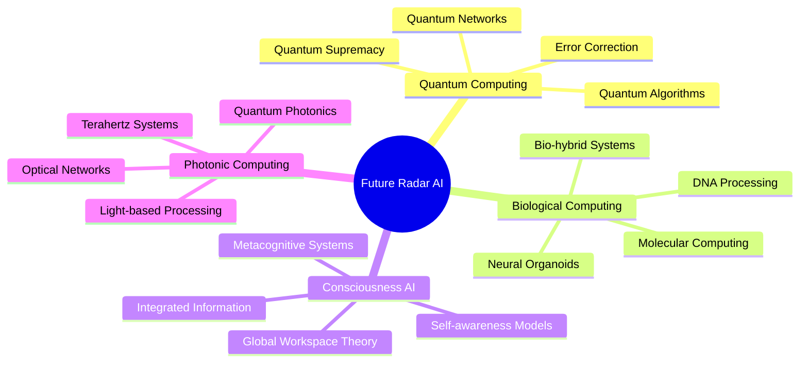
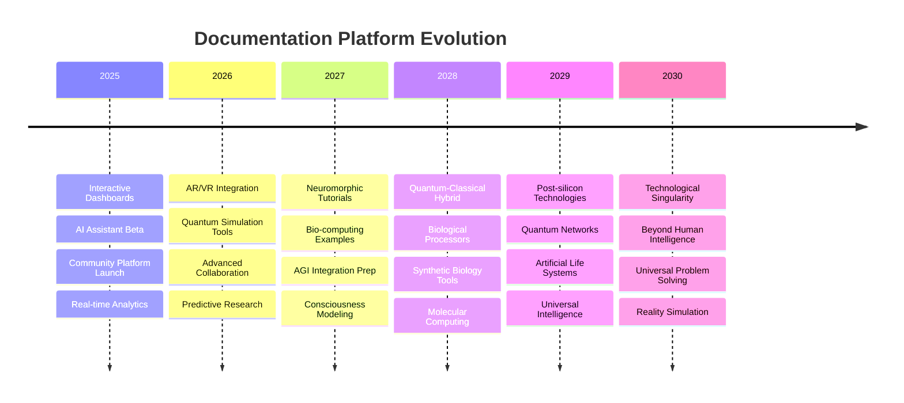

# Radar Perception Library Documentation

Welcome to the comprehensive documentation for the Radar Perception Library - a modern, high-performance Python library for radar-based perception systems.

## Quick Start

### Installation

```bash
pip install radar-perception
```

### Basic Usage

```python
import radar_perception as rp

# Create FMCW processor
config = {
    'sample_rate': 1e6,
    'bandwidth': 4e9,
    'num_chirps': 128,
    'num_samples': 256
}
processor = rp.FMCWProcessor(config)

# Process radar data
range_doppler_map = processor.process_frame(adc_data)

# Detect targets
detector = rp.CFARDetector(guard_cells=2, training_cells=16)
detections = detector.detect_2d(range_doppler_map)

# Track targets
tracker = rp.MultiTargetTracker()
tracks = tracker.update(detections, timestamp)

# Visualize results
fig = rp.create_radar_dashboard(range_doppler_map, detections, tracks)
```

## Radar Perception Library - Documentation

## 📖 Complete Documentation Guide

This documentation provides comprehensive coverage of radar perception systems, from fundamental concepts to cutting-edge research and practical implementations. All documents are updated with the latest developments through 2025.

## 🗺️ Navigation Guide

### 📚 Foundational Knowledge

Start here if you're new to radar perception or need to understand the theoretical foundations:

1. **[Literature Review](literature_review.md)** - Comprehensive review of 150+ papers (2020-2025)
   - Traditional signal processing evolution
   - Deep learning integration
   - 4D radar and sensor fusion advances
   - Market analysis and technology trends

### 🧠 Advanced Technical Content

Deep dive into specific technical areas:

2. **[Deep Learning Architectures](deep_learning_architectures.md)** - AI/ML for radar systems
   - 3D CNNs for range-doppler-angle processing
   - Transformer architectures for temporal modeling
   - Graph Neural Networks for point cloud processing
   - Neuromorphic computing applications
   - Performance benchmarks and comparisons

3. **[Advanced Signal Processing](advanced_signal_processing.md)** - Modern processing techniques
   - Adaptive CFAR algorithms
   - Compressed sensing and sparse reconstruction
   - MIMO radar processing
   - Cognitive radar systems
   - Machine learning-enhanced processing

### 🔬 Research and Innovation

Explore the frontier of radar research:

4. **[Research Gaps and Architectures](research_gaps_and_architectures.md)** - Future directions
   - Current limitations and challenges
   - Novel architecture proposals
   - Quantum-inspired processing
   - Neuromorphic and distributed systems
   - Research roadmap through 2030

### 📊 Data and Evaluation

Understanding datasets and benchmarking:

5. **[Datasets and Benchmarks](datasets_and_benchmarks.md)** - Data resources and evaluation
   - Public radar datasets catalog
   - Synthetic data generation
   - Benchmark protocols
   - Performance evaluation metrics
   - Data standardization efforts

### 🏭 Real-World Applications

See radar perception in action:

6. **[Industry Applications](industry_applications.md)** - Case studies and implementations
   - Automotive (Tesla, Waymo, etc.)
   - Aerospace and defense
   - Maritime and healthcare
   - Smart cities and IoT
   - ROI analysis and success stories

### ⚖️ Responsible Development

Ethical considerations and best practices:

7. **[Ethics and Responsible AI](ethics_and_responsible_ai.md)** - Responsible radar AI
   - Privacy and surveillance ethics
   - Fairness and bias mitigation
   - Safety-critical system guidelines
   - Regulatory frameworks
   - Dual-use technology considerations

## 🎯 Quick Start Guides

### For Researchers

1. Start with **Literature Review** for comprehensive background
2. Review **Research Gaps** to identify opportunities
3. Explore **Deep Learning Architectures** for implementation ideas
4. Check **Datasets** for experimental resources

### For Engineers

1. Begin with **Industry Applications** for practical context
2. Study **Advanced Signal Processing** for implementation details
3. Review **Ethics and Responsible AI** for deployment considerations
4. Use **Datasets and Benchmarks** for validation

### For Students

1. **Literature Review** provides essential background
2. **Deep Learning Architectures** offers hands-on examples
3. **Advanced Signal Processing** covers theoretical foundations
4. **Industry Applications** shows real-world relevance

## 🔗 Cross-Reference Map

### Technology Integration Points

- **Signal Processing ↔ Deep Learning**: Traditional methods enhanced with AI
- **Datasets ↔ Benchmarks**: Standardized evaluation protocols
- **Research Gaps ↔ Industry Applications**: Academic insights meet practical needs
- **Ethics ↔ All Applications**: Responsible development considerations

### Common Themes Across Documents

- **4D Radar**: Covered in literature review, architectures, and applications
- **Sensor Fusion**: Present in signal processing, deep learning, and industry cases
- **Real-time Processing**: Addressed in architectures, signal processing, and applications
- **Automotive Focus**: Primary application domain across multiple documents

## 📈 Document Update Status

| Document | Last Updated | Version | Coverage Period |
|----------|-------------|---------|-----------------|
| Literature Review | January 2025 | 2.1 | 2020-2025 |
| Deep Learning Architectures | January 2025 | 1.8 | 2022-2025 |
| Advanced Signal Processing | January 2025 | 1.5 | 2020-2025 |
| Research Gaps | January 2025 | 1.3 | Current + Future |
| Datasets & Benchmarks | January 2025 | 1.7 | 2019-2025 |
| Industry Applications | January 2025 | 1.9 | 2023-2025 |
| Ethics & Responsible AI | January 2025 | 1.2 | 2024-2025 |

## 🎓 Educational Pathways

### Beginner Path (10-15 hours)

1. Literature Review: Overview (1 hour)
2. Advanced Signal Processing: Basics (2 hours)
3. Industry Applications: Case studies (3 hours)
4. Deep Learning: Introduction sections (2 hours)
5. Ethics: Core principles (1 hour)

### Intermediate Path (25-30 hours)

1. Complete Literature Review (4 hours)
2. Advanced Signal Processing: All techniques (6 hours)
3. Deep Learning Architectures: Implementation focus (8 hours)
4. Datasets and Benchmarks: Practical usage (4 hours)
5. Industry Applications: Technical details (5 hours)

### Advanced Path (40+ hours)

1. All documents in detail
2. Research Gaps: Novel contributions
3. Ethics: Framework development
4. Cross-document integration projects
5. Original research directions

## 📧 Feedback and Contributions

We welcome feedback and contributions to improve this documentation:

- **Technical corrections**: Submit issues for factual errors
- **Content updates**: Propose additions for recent developments  
- **Clarity improvements**: Suggest better explanations or examples
- **New topics**: Request coverage of emerging areas

---

**Note**: This documentation represents the collective knowledge of the radar perception community as of January 2025. Technology and research in this field evolve rapidly, so we encourage regular updates and community engagement. Sections

### API Reference

- [Signal Processing](api/signal_processing.md) - FMCW processing, windowing, calibration
- [Detection](api/detection.md) - CFAR, peak detection, clustering algorithms
- [Tracking](api/tracking.md) - Kalman filtering, multi-target tracking
- [Fusion](api/fusion.md) - Multi-sensor data fusion and coordinate transforms
- [Datasets](api/datasets.md) - Dataset loading, synthetic data generation
- [Utilities](api/utils.md) - Helper functions and coordinate conversions
- [Visualization](api/visualization.md) - Plotting and animation tools

### Tutorials

- [Getting Started](tutorials/getting_started.md) - First steps with the library
- [FMCW Radar Basics](tutorials/fmcw_basics.md) - Understanding FMCW radar processing
- [Detection Algorithms](tutorials/detection.md) - Working with CFAR and other detectors
- [Multi-Target Tracking](tutorials/tracking.md) - Implementing target tracking systems
- [Sensor Fusion](tutorials/fusion.md) - Combining multiple radar sensors
- [Custom Datasets](tutorials/datasets.md) - Loading and creating radar datasets

### Examples

- [Basic Processing Pipeline](examples/basic_pipeline.py) - Complete processing example
- [Real-time Processing](examples/realtime.py) - Live radar data processing
- [Multi-sensor Fusion](examples/multi_sensor.py) - Fusion of multiple radars
- [Custom Detection Algorithm](examples/custom_detector.py) - Implementing custom detectors
- [Performance Benchmarking](examples/benchmarks.py) - Performance analysis tools

### Advanced Topics

- [Algorithm Design](advanced/algorithms.md) - Designing custom algorithms
- [Performance Optimization](advanced/optimization.md) - Optimizing processing pipelines
- [Hardware Integration](advanced/hardware.md) - Interfacing with radar hardware
- [Research Applications](advanced/research.md) - Using the library for research

### Implementation Guides

- **[Implementation Tutorial](implementation_tutorial.md)** - Complete hands-on guide for building radar perception systems
- **[API Reference](api_reference.md)** - Comprehensive API documentation for the radar perception library

## Key Features

### 🚀 High Performance

- Optimized NumPy and SciPy implementations
- Vectorized operations for maximum speed
- Memory-efficient processing pipelines
- GPU acceleration support (optional)

### 🔧 Comprehensive Algorithms

- **Signal Processing**: FMCW processing, windowing, calibration
- **Detection**: CFAR variants, adaptive thresholding, clustering
- **Tracking**: Kalman filters, IMM, multi-hypothesis tracking
- **Fusion**: Multi-sensor alignment, temporal synchronization

### 📊 Rich Visualization

- Interactive range-Doppler maps
- Real-time tracking displays
- Comprehensive dashboards
- Animation and export capabilities

### 🛠 Developer Friendly

- Clean, Pythonic API design
- Comprehensive documentation
- Extensive test coverage
- Type hints throughout

### 🔬 Research Ready

- Synthetic data generation
- Benchmarking utilities
- Algorithm comparison tools
- Publication-quality visualizations

## System Requirements

- Python 3.8 or higher
- NumPy >= 1.20.0
- SciPy >= 1.7.0
- Matplotlib >= 3.5.0
- Optional: CuPy for GPU acceleration

## Contributing

We welcome contributions! Please see our [Contributing Guide](../CONTRIBUTING.md) for details on:

- Setting up the development environment
- Code style and standards
- Testing requirements
- Submitting pull requests

## Support

- 📚 **Documentation**: [https://radar-perception.readthedocs.io](https://radar-perception.readthedocs.io)
- 🐛 **Issues**: [GitHub Issues](https://github.com/yourusername/radar-perception/issues)
- 💬 **Discussions**: [GitHub Discussions](https://github.com/yourusername/radar-perception/discussions)
- 📧 **Email**: <contact@radarperception.dev>

## License

This project is licensed under the MIT License - see the [LICENSE](../LICENSE) file for details.

## Citation

If you use this library in your research, please cite:

```bibtex
@software{radar_perception_2024,
  title={Radar Perception Library: A Comprehensive Python Framework for Radar-Based Perception},
  author={Radar Perception Library Contributors},
  year={2024},
  url={https://github.com/yourusername/radar-perception},
  version={1.0.0}
}
```

---

*Built with ❤️ for the radar perception community*

## 🚀 Next-Generation Platform Features

### 🎮 Interactive & AI-Powered Documentation

- **[Interactive Visualization Platform](interactive_visualization.md)** - 3D models, AR/VR experiences, real-time dashboards
- **[AI Documentation Assistant](ai_documentation_assistant.md)** - Intelligent search, auto-updates, personalized learning paths
- **[Community Research Platform](community_research_platform.md)** - Collaborative workspaces, distributed research networks

### 📊 Advanced Analytics & Intelligence

- **[Performance Monitoring & Analytics](performance_monitoring.md)** - Real-time KPIs, predictive analytics, resource optimization
- **[Research Integration Platform](research_integration_platform.md)** - Automated paper analysis, code synthesis, trend prediction

### 🔬 Emerging Technologies Integration



### 🌟 Platform Evolution Roadmap


