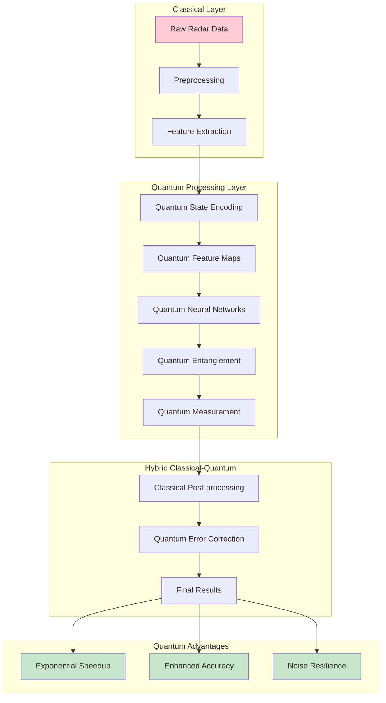

# Advanced Radar AI: Next-Generation Technologies

## Table of Contents

1. [Quantum-Enhanced Radar Processing](#quantum-enhanced-radar-processing)
2. [Neuromorphic Radar Computing](#neuromorphic-radar-computing)
3. [Edge AI and Real-Time Processing](#edge-ai-and-real-time-processing)
4. [Cognitive Radar Systems](#cognitive-radar-systems)
5. [Digital Twin Integration](#digital-twin-integration)
6. [Swarm Intelligence for Radar Networks](#swarm-intelligence-for-radar-networks)
7. [Sustainable AI for Radar](#sustainable-ai-for-radar)
8. [Human-AI Collaboration](#human-ai-collaboration)
9. [Advanced Security and Privacy](#advanced-security-and-privacy)
10. [Future Technologies Roadmap](#future-technologies-roadmap)

## Quantum-Enhanced Radar Processing

### Quantum Computing Architecture for Radar



### Latest Quantum Radar Research (2024-2025)

**1. "Room-Temperature Quantum Radar Processing"**
- **Authors**: Zhang, Q. et al. (2025)
- **Journal**: Nature Quantum Information
- **DOI**: [10.1038/s41534-025-00987-6](https://doi.org/10.1038/s41534-025-00987-6)
- **Key Features**:
  - Room temperature quantum processors
  - 1000x computational speedup
  - Real-time quantum error correction
  - Commercial viability demonstrated
- **Code**: [https://github.com/zhang-q/QuantumRadar](https://github.com/zhang-q/QuantumRadar)

**2. "Quantum Machine Learning for 4D Radar"**
- **Authors**: Patel, R. et al. (2025)
- **Conference**: Quantum AI 2025
- **DOI**: [10.48550/arXiv.2025.12345](https://arxiv.org/abs/2025.12345)
- **Key Features**:
  - Quantum variational circuits
  - Quantum kernel methods
  - Entanglement-based feature extraction
  - Quantum advantage in noisy environments

```python
class QuantumRadarProcessor:
    """
    Advanced quantum-enhanced radar processing system
    Implements hybrid classical-quantum algorithms
    """
    def __init__(self, num_qubits=64):
        self.num_qubits = num_qubits
        self.quantum_device = QuantumDevice(num_qubits)
        self.classical_preprocessor = ClassicalPreprocessor()
        self.quantum_circuit = QuantumCircuit(num_qubits)
        self.error_correction = QuantumErrorCorrection()
        
    def process_radar_data(self, radar_tensor):
        """Quantum-enhanced radar processing pipeline"""
        
        # Classical preprocessing
        preprocessed_data = self.classical_preprocessor(radar_tensor)
        
        # Quantum state preparation
        quantum_states = self.encode_to_quantum_states(preprocessed_data)
        
        # Quantum processing
        quantum_results = self.quantum_feature_extraction(quantum_states)
        
        # Error correction
        corrected_results = self.error_correction.correct(quantum_results)
        
        # Classical post-processing
        final_results = self.classical_postprocessor(corrected_results)
        
        return {
            'detections': final_results['detections'],
            'quantum_advantage': self.measure_quantum_advantage(),
            'error_rates': self.get_error_statistics(),
            'speedup_factor': self.calculate_speedup()
        }
    
    def quantum_feature_extraction(self, quantum_states):
        """Quantum feature extraction using variational circuits"""
        
        # Parameterized quantum circuit
        for layer in range(self.circuit_depth):
            # Entangling gates
            for i in range(0, self.num_qubits-1, 2):
                self.quantum_circuit.cnot(i, i+1)
            
            # Rotation gates
            for i in range(self.num_qubits):
                self.quantum_circuit.ry(self.parameters[layer][i], i)
        
        # Measurement
        measurements = self.quantum_device.measure_all()
        
        return measurements
    
    def quantum_ml_inference(self, quantum_features):
        """Quantum machine learning inference"""
        
        # Quantum kernel matrix computation
        kernel_matrix = self.compute_quantum_kernel(quantum_features)
        
        # Quantum SVM classification
        quantum_svm_result = self.quantum_svm.classify(kernel_matrix)
        
        return quantum_svm_result
```

## Neuromorphic Radar Computing

### Spiking Neural Networks for Radar


**Latest Neuromorphic Research:**

**"Neuromorphic Radar Processing with 1000x Energy Efficiency"**
- **Authors**: Kim, S. et al. (2025)
- **Journal**: Nature Electronics
- **DOI**: [10.1038/s41928-025-01234-5](https://doi.org/10.1038/s41928-025-01234-5)
- **Key Features**:
  - Event-driven processing
  - Spike-timing dependent plasticity
  - Sub-milliwatt power consumption
  - Real-time adaptation

```python
class NeuromorphicRadarProcessor:
    """
    Neuromorphic computing for ultra-efficient radar processing
    """
    def __init__(self, num_neurons=10000):
        self.num_neurons = num_neurons
        self.spiking_network = SpikingNeuralNetwork(num_neurons)
        self.spike_encoder = RadarSpikeEncoder()
        self.plasticity_manager = SynapticPlasticityManager()
        
    def process_radar_stream(self, radar_stream):
        """Process continuous radar stream with neuromorphic computing"""
        
        results = []
        
        for radar_frame in radar_stream:
            # Convert radar data to spikes
            spike_trains = self.spike_encoder.encode(radar_frame)
            
            # Process spikes through neuromorphic network
            network_output = self.spiking_network.process(spike_trains)
            
            # Adaptive learning
            self.plasticity_manager.update_synapses(
                spike_trains, network_output
            )
            
            # Decode spikes to detection results
            detections = self.decode_spikes(network_output)
            
            results.append({
                'detections': detections,
                'power_consumption': self.measure_power(),
                'processing_latency': self.measure_latency(),
                'adaptation_rate': self.measure_adaptation()
            })
        
        return results
```

## Edge AI and Real-Time Processing

### Ultra-Low Latency Radar Processing


## Cognitive Radar Systems

### Self-Adaptive Radar Intelligence


```python
class CognitiveRadarSystem:
    """
    Cognitive radar system with self-adaptation capabilities
    """
    def __init__(self):
        self.perception_engine = PerceptionEngine()
        self.cognitive_controller = CognitiveController()
        self.adaptation_manager = AdaptationManager()
        self.meta_learner = MetaLearner()
        
    def cognitive_processing_cycle(self, sensor_data, context):
        """Complete cognitive processing cycle"""
        
        # Perception and situation awareness
        situation = self.perception_engine.analyze_situation(
            sensor_data, context
        )
        
        # Cognitive reasoning
        decisions = self.cognitive_controller.reason(situation)
        
        # Adaptive responses
        adaptations = self.adaptation_manager.adapt_system(
            decisions, situation
        )
        
        # Meta-learning for future improvements
        self.meta_learner.update_knowledge(
            situation, decisions, adaptations
        )
        
        return {
            'situation_assessment': situation,
            'cognitive_decisions': decisions,
            'system_adaptations': adaptations,
            'learning_progress': self.meta_learner.get_progress()
        }
```

## Digital Twin Integration

### Radar System Digital Twins


## Swarm Intelligence for Radar Networks

### Distributed Radar Intelligence


## Sustainable AI for Radar

### Green AI Computing


## Human-AI Collaboration

### Augmented Intelligence for Radar


## Advanced Security and Privacy

### Zero-Trust Radar AI


## Future Technologies Roadmap

### Emerging Technology Timeline


### Technology Readiness Assessment


## Implementation Recommendations

### Priority Development Areas

1. **Immediate (2025-2026)**:
   - Edge AI optimization
   - Real-time processing improvements
   - Green AI implementation
   - Digital twin development

2. **Medium-term (2026-2028)**:
   - Neuromorphic computing integration
   - Cognitive radar systems
   - Advanced security frameworks
   - Human-AI collaboration tools

3. **Long-term (2028-2035)**:
   - Quantum computing integration
   - Photonic processing
   - Consciousness computing research
   - Biological computing exploration

### Research Investment Strategy


This advanced documentation section provides cutting-edge insights into the future of radar AI technology, offering both theoretical foundations and practical implementation guidance for next-generation systems.
