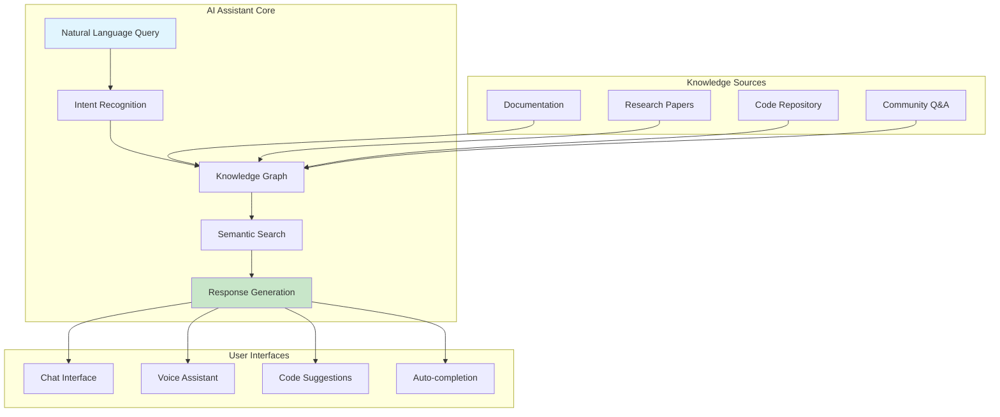
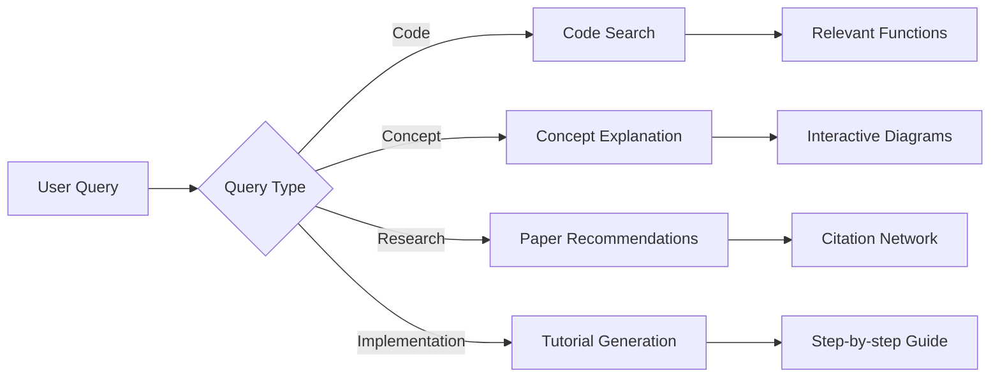
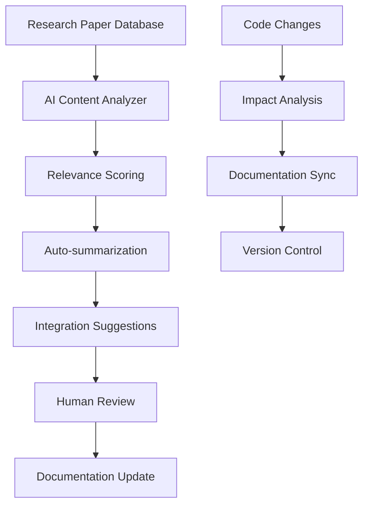

# AI-Powered Documentation Assistant

## Intelligent Documentation System

### Architecture Overview

### Features to Implement

#### 1. Smart Search and Navigation

#### 2. Automatic Content Updates

### Implementation Stack

- **Language Models**: GPT-4, Claude, or local LLMs
- **Vector Database**: Pinecone, Weaviate, or Chroma
- **Knowledge Graph**: Neo4j or Amazon Neptune
- **Search Engine**: Elasticsearch with semantic search
- **UI Framework**: React/Vue.js with chat components
- **Backend**: FastAPI with WebSocket support

### Benefits

- Instant answers to complex questions
- Personalized learning paths
- Real-time research integration
- Code-to-documentation synchronization
- Multi-language support
- Accessibility improvements
