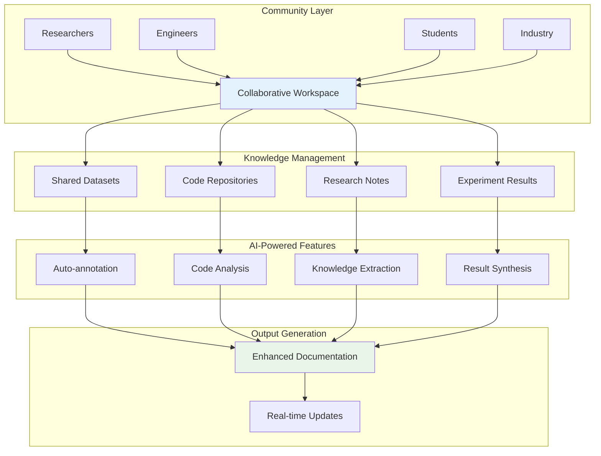
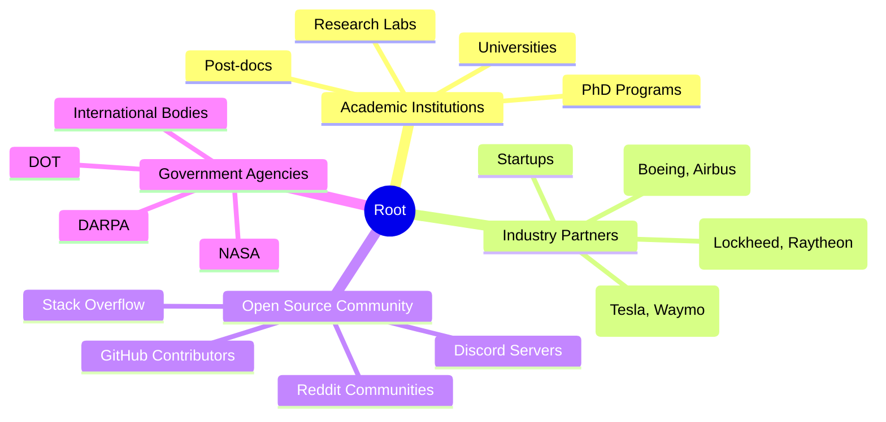
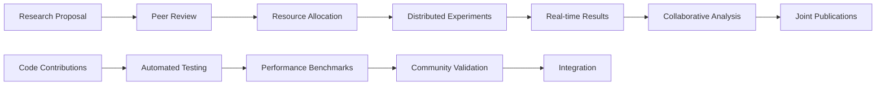
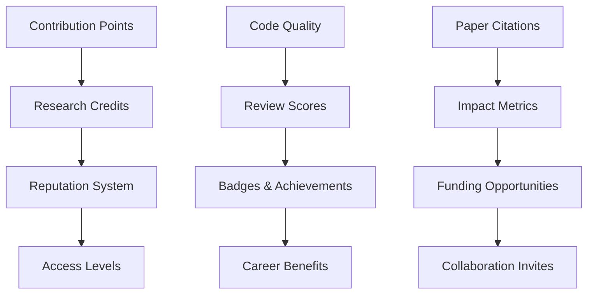

# Community-Driven Research Platform

## Collaborative Research Ecosystem

### Platform Architecture

### Key Features

#### 1. Distributed Research Network

#### 2. Collaborative Tools

#### 3. Gamification and Incentives

### Implementation Technologies

- **Collaboration Platform**: Discord/Slack integration with custom bots
- **Version Control**: Git with advanced branching strategies
- **Project Management**: Notion/Obsidian for knowledge management
- **Communication**: Video conferencing with whiteboard integration
- **Data Sharing**: IPFS for decentralized storage
- **Blockchain**: For attribution and incentive mechanisms

### Benefits

- Accelerated research pace through collaboration
- Reduced duplication of efforts
- Cross-pollination of ideas
- Real-time knowledge sharing
- Global expertise accessibility
- Transparent peer review process
