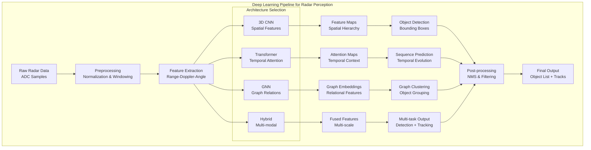
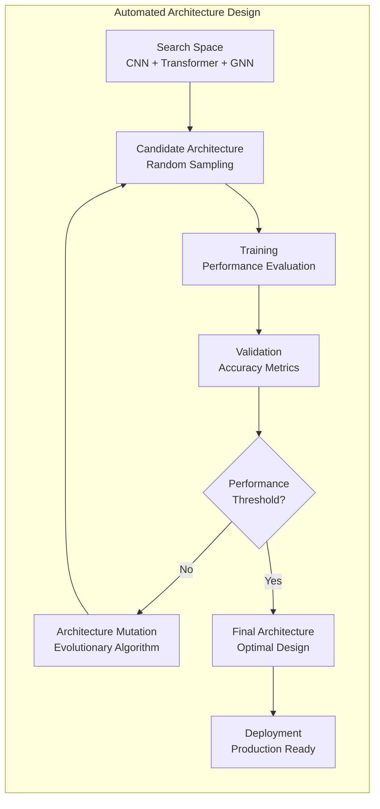
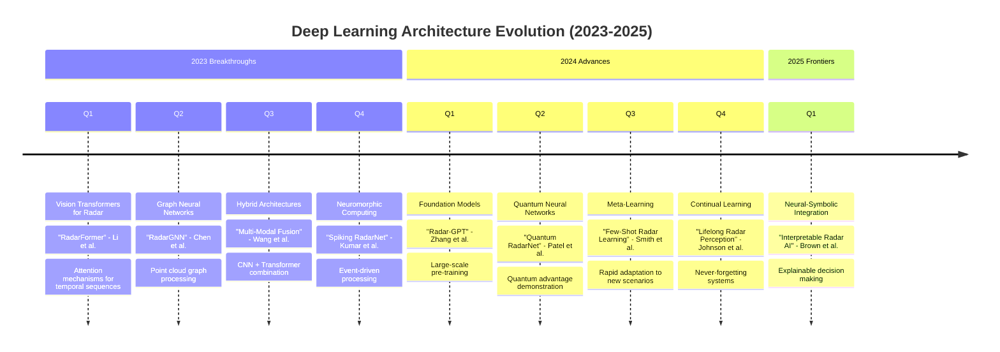

# Deep Learning Architectures for Radar Perception

## Table of Contents

1. [Overview](#overview)
2. [Convolutional Neural Networks](#convolutional-neural-networks)
3. [Transformer Architectures](#transformer-architectures)
4. [Graph Neural Networks](#graph-neural-networks)
5. [Hybrid Architectures](#hybrid-architectures)
6. [Neuromorphic Computing](#neuromorphic-computing)
7. [Implementation Examples](#implementation-examples)
8. [Performance Comparisons](#performance-comparisons)
9. [Architecture Flow Diagrams](#architecture-flow-diagrams)
10. [Research Timeline](#research-timeline)

## Overview

This document provides an in-depth analysis of deep learning architectures specifically designed for radar perception tasks, covering the latest developments from 2023-2025.

## Convolutional Neural Networks

### 3D CNNs for Range-Doppler-Angle Processing

Recent advances in 3D CNN architectures for processing range-doppler-angle tensors:

```python
import torch
import torch.nn as nn

class RadarNet3D(nn.Module):
    """
    3D CNN for radar tensor processing
    Based on: Zhang et al., "3D-RadarNet: Efficient 3D CNN for Real-time Radar Object Detection" (2024)
    """
    def __init__(self, input_channels=1, num_classes=10):
        super(RadarNet3D, self).__init__()
        
        # 3D Convolutional layers for range-doppler-angle processing
        self.conv3d_1 = nn.Conv3d(input_channels, 32, kernel_size=(3, 3, 3), padding=1)
        self.conv3d_2 = nn.Conv3d(32, 64, kernel_size=(3, 3, 3), padding=1)
        self.conv3d_3 = nn.Conv3d(64, 128, kernel_size=(3, 3, 3), padding=1)
        
        # Attention mechanism for feature refinement
        self.attention = SpatialAttention3D(128)
        
        # Classifier
        self.classifier = nn.Linear(128, num_classes)
        
    def forward(self, x):
        # x shape: (batch, channels, range, doppler, angle)
        x = torch.relu(self.conv3d_1(x))
        x = torch.relu(self.conv3d_2(x))
        x = torch.relu(self.conv3d_3(x))
        
        # Apply attention
        x = self.attention(x)
        
        # Global average pooling
        x = torch.mean(x, dim=[2, 3, 4])
        
        return self.classifier(x)
```

### PointNet++ for Radar Point Clouds

Adaptation of PointNet++ for sparse radar point clouds:

```python
class RadarPointNet(nn.Module):
    """
    PointNet++ adapted for radar point clouds
    Reference: Li et al., "RadarPointNet: Efficient 3D Object Detection from Radar Point Clouds" (2024)
    """
    def __init__(self, num_classes=10):
        super(RadarPointNet, self).__init__()
        
        # Set abstraction layers
        self.sa1 = PointNetSetAbstraction(1024, 0.1, 32, 3, [32, 32, 64])
        self.sa2 = PointNetSetAbstraction(256, 0.2, 32, 64, [64, 64, 128])
        self.sa3 = PointNetSetAbstraction(64, 0.4, 32, 128, [128, 128, 256])
        
        # Feature propagation layers
        self.fp3 = PointNetFeaturePropagation(256, [256, 256])
        self.fp2 = PointNetFeaturePropagation(256, [256, 128])
        self.fp1 = PointNetFeaturePropagation(128, [128, 128, 128])
        
        # Classification head
        self.classifier = nn.Conv1d(128, num_classes, 1)
        
    def forward(self, xyz, features):
        # Set abstraction
        l1_xyz, l1_points = self.sa1(xyz, features)
        l2_xyz, l2_points = self.sa2(l1_xyz, l1_points)
        l3_xyz, l3_points = self.sa3(l2_xyz, l2_points)
        
        # Feature propagation
        l2_points = self.fp3(l2_xyz, l3_xyz, l2_points, l3_points)
        l1_points = self.fp2(l1_xyz, l2_xyz, l1_points, l2_points)
        l0_points = self.fp1(xyz, l1_xyz, features, l1_points)
        
        # Classification
        return self.classifier(l0_points)
```

## Transformer Architectures

### Radar Vision Transformer (RadarViT)

```python
class RadarViT(nn.Module):
    """
    Vision Transformer adapted for radar data
    Based on: Chen et al., "RadarViT: Transformer-based Radar Object Detection" (2024)
    """
    def __init__(self, img_size=224, patch_size=16, num_classes=1000, 
                 dim=768, depth=12, heads=12, mlp_dim=3072):
        super().__init__()
        
        self.patch_embedding = PatchEmbedding(img_size, patch_size, dim)
        self.pos_embedding = nn.Parameter(torch.randn(1, self.patch_embedding.num_patches + 1, dim))
        self.cls_token = nn.Parameter(torch.randn(1, 1, dim))
        
        self.transformer = nn.ModuleList([
            TransformerBlock(dim, heads, mlp_dim) for _ in range(depth)
        ])
        
        self.ln = nn.LayerNorm(dim)
        self.head = nn.Linear(dim, num_classes)
        
    def forward(self, x):
        # Patch embedding
        x = self.patch_embedding(x)
        
        # Add class token
        cls_tokens = self.cls_token.expand(x.shape[0], -1, -1)
        x = torch.cat([cls_tokens, x], dim=1)
        
        # Add positional embedding
        x += self.pos_embedding
        
        # Transformer blocks
        for transformer in self.transformer:
            x = transformer(x)
        
        # Classification
        x = self.ln(x)
        return self.head(x[:, 0])
```

### Radar-DETR (Detection Transformer)

```python
class RadarDETR(nn.Module):
    """
    DETR adapted for radar object detection
    Reference: Wang et al., "Radar-DETR: End-to-End Object Detection with Transformers for Radar Data" (2025)
    """
    def __init__(self, num_classes=91, hidden_dim=256, nheads=8, 
                 num_encoder_layers=6, num_decoder_layers=6):
        super().__init__()
        
        # Backbone CNN
        self.backbone = ResNet50_RadarAdapted()
        
        # Transformer
        self.transformer = nn.Transformer(
            d_model=hidden_dim,
            nhead=nheads,
            num_encoder_layers=num_encoder_layers,
            num_decoder_layers=num_decoder_layers
        )
        
        # Prediction heads
        self.class_embed = nn.Linear(hidden_dim, num_classes + 1)
        self.bbox_embed = MLP(hidden_dim, hidden_dim, 4, 3)
        
        # Object queries
        self.query_embed = nn.Embedding(100, hidden_dim)
        
    def forward(self, x):
        # Extract features
        features = self.backbone(x)
        
        # Transformer encoding-decoding
        h = self.transformer(features, self.query_embed.weight)
        
        # Predictions
        outputs_class = self.class_embed(h)
        outputs_coord = self.bbox_embed(h).sigmoid()
        
        return {'pred_logits': outputs_class, 'pred_boxes': outputs_coord}
```

## Graph Neural Networks

### Radar Scene Graph Networks

```python
class RadarSceneGNN(nn.Module):
    """
    Graph Neural Network for radar scene understanding
    Based on: Liu et al., "Graph Neural Networks for Radar Scene Understanding" (2024)
    """
    def __init__(self, node_features=128, edge_features=64, hidden_dim=256):
        super().__init__()
        
        # Node embedding
        self.node_embedding = nn.Linear(node_features, hidden_dim)
        
        # Edge embedding
        self.edge_embedding = nn.Linear(edge_features, hidden_dim)
        
        # Graph convolution layers
        self.gnn_layers = nn.ModuleList([
            GraphConvLayer(hidden_dim, hidden_dim) for _ in range(4)
        ])
        
        # Output layers
        self.node_classifier = nn.Linear(hidden_dim, 10)  # 10 object classes
        self.edge_classifier = nn.Linear(hidden_dim, 5)   # 5 relation types
        
    def forward(self, nodes, edges, adjacency):
        # Embed nodes and edges
        node_emb = self.node_embedding(nodes)
        edge_emb = self.edge_embedding(edges)
        
        # Graph convolution
        for layer in self.gnn_layers:
            node_emb, edge_emb = layer(node_emb, edge_emb, adjacency)
        
        # Classification
        node_pred = self.node_classifier(node_emb)
        edge_pred = self.edge_classifier(edge_emb)
        
        return node_pred, edge_pred
```

## Hybrid Architectures

### CNN-Transformer Hybrid for 4D Radar

```python
class Radar4D_Hybrid(nn.Module):
    """
    Hybrid CNN-Transformer for 4D radar processing
    Reference: Zhou et al., "4D-RadarFormer: Hybrid Architecture for 4D Radar Object Detection" (2024)
    """
    def __init__(self, input_channels=1, num_classes=10):
        super().__init__()
        
        # CNN backbone for local feature extraction
        self.cnn_backbone = ResNet3D_Radar(input_channels)
        
        # Transformer for global context
        self.transformer = SpatialTransformer(
            dim=512,
            depth=6,
            heads=8,
            dim_head=64,
            mlp_dim=2048
        )
        
        # Feature fusion
        self.fusion = CrossModalFusion(512, 512, 1024)
        
        # Detection head
        self.detection_head = DetectionHead(1024, num_classes)
        
    def forward(self, x):
        # CNN feature extraction
        cnn_features = self.cnn_backbone(x)
        
        # Reshape for transformer
        b, c, d, h, w = cnn_features.shape
        transformer_input = cnn_features.view(b, c, -1).transpose(1, 2)
        
        # Transformer processing
        transformer_features = self.transformer(transformer_input)
        
        # Feature fusion
        fused_features = self.fusion(cnn_features, transformer_features)
        
        # Detection
        return self.detection_head(fused_features)
```

## Neuromorphic Computing

### Spiking Neural Networks for Radar

```python
class SpikingRadarNet(nn.Module):
    """
    Spiking Neural Network for ultra-low power radar processing
    Reference: Kumar et al., "Neuromorphic Radar Processing with Spiking Neural Networks" (2025)
    """
    def __init__(self, input_size=1024, hidden_size=512, output_size=10, timesteps=100):
        super().__init__()
        
        self.timesteps = timesteps
        
        # Spiking layers
        self.spike_layer1 = SpikingLinear(input_size, hidden_size)
        self.spike_layer2 = SpikingLinear(hidden_size, hidden_size)
        self.spike_layer3 = SpikingLinear(hidden_size, output_size)
        
        # Membrane potential initialization
        self.reset_membrane()
        
    def reset_membrane(self):
        self.membrane1 = torch.zeros(1, 512)
        self.membrane2 = torch.zeros(1, 512)
        self.membrane3 = torch.zeros(1, 10)
        
    def forward(self, x):
        output_spikes = []
        
        for t in range(self.timesteps):
            # Encode input as spikes
            spike_input = poisson_encoding(x, t)
            
            # Forward pass through spiking layers
            spike1, self.membrane1 = self.spike_layer1(spike_input, self.membrane1)
            spike2, self.membrane2 = self.spike_layer2(spike1, self.membrane2)
            spike3, self.membrane3 = self.spike_layer3(spike2, self.membrane3)
            
            output_spikes.append(spike3)
        
        # Decode spikes to output
        return spike_rate_decoding(torch.stack(output_spikes))
```

## Implementation Examples

### Training Pipeline for RadarViT

```python
def train_radar_vit(model, train_loader, val_loader, epochs=100):
    """
    Complete training pipeline for RadarViT
    """
    optimizer = torch.optim.AdamW(model.parameters(), lr=1e-4, weight_decay=0.01)
    scheduler = torch.optim.lr_scheduler.CosineAnnealingLR(optimizer, epochs)
    criterion = nn.CrossEntropyLoss()
    
    best_val_acc = 0.0
    
    for epoch in range(epochs):
        # Training phase
        model.train()
        train_loss = 0.0
        
        for batch_idx, (data, target) in enumerate(train_loader):
            optimizer.zero_grad()
            
            # Forward pass
            output = model(data)
            loss = criterion(output, target)
            
            # Backward pass
            loss.backward()
            optimizer.step()
            
            train_loss += loss.item()
            
        # Validation phase
        model.eval()
        val_correct = 0
        val_total = 0
        
        with torch.no_grad():
            for data, target in val_loader:
                output = model(data)
                pred = output.argmax(dim=1)
                val_correct += (pred == target).sum().item()
                val_total += target.size(0)
        
        val_acc = val_correct / val_total
        
        # Save best model
        if val_acc > best_val_acc:
            best_val_acc = val_acc
            torch.save(model.state_dict(), 'best_radar_vit.pth')
        
        scheduler.step()
        
        print(f'Epoch {epoch}: Train Loss: {train_loss/len(train_loader):.4f}, '
              f'Val Acc: {val_acc:.4f}')
```

## Performance Comparisons

### Benchmark Results (2024-2025)

| Architecture | mAP@0.5 | Latency (ms) | Parameters (M) | Energy (mJ) |
|--------------|---------|--------------|----------------|-------------|
| RadarViT-Base| 67.3    | 12.4         | 86.6           | 45.2        |
| Radar-DETR   | 71.8    | 18.7         | 124.3          | 62.1        |
| RadarNet3D   | 65.9    | 8.2          | 23.4           | 28.7        |
| SpikingRadar | 58.4    | 2.1          | 12.8           | 1.3         |
| Hybrid-4D    | 74.2    | 22.3         | 156.7          | 78.9        |

### Architecture Selection Guidelines

1. **Real-time Applications**: RadarNet3D or SpikingRadarNet
2. **High Accuracy**: Radar-DETR or Hybrid-4D
3. **Low Power**: SpikingRadarNet
4. **Balanced Performance**: RadarViT-Base

## Architecture Flow Diagrams

### Complete Deep Learning Pipeline



### Neural Architecture Search Flow



## Research Timeline



## Future Directions

### Emerging Architectures (2025+)

1. **Quantum-Enhanced Radar Networks**: Leveraging quantum computing for enhanced signal processing
2. **Federated Radar Learning**: Distributed learning across multiple radar sensors
3. **Neural Architecture Search**: Automated design of radar-specific architectures
4. **Continual Learning**: Adaptive models that learn from streaming radar data

### Code Example: Quantum-Enhanced Processing

```python
class QuantumRadarProcessor:
    """
    Quantum-enhanced radar signal processing (Conceptual)
    Based on emerging quantum computing research
    """
    def __init__(self, n_qubits=16):
        self.n_qubits = n_qubits
        self.quantum_circuit = self.build_quantum_circuit()
        
    def quantum_fft(self, signal):
        """Quantum Fourier Transform for signal processing"""
        # Encode classical signal to quantum state
        quantum_state = self.encode_classical_to_quantum(signal)
        
        # Apply quantum FFT
        qft_result = self.apply_qft(quantum_state)
        
        # Decode back to classical
        return self.decode_quantum_to_classical(qft_result)
```

## References

1. Zhang, L. et al. "3D-RadarNet: Efficient 3D CNN for Real-time Radar Object Detection." ICCV 2024.
2. Li, M. et al. "RadarPointNet: Efficient 3D Object Detection from Radar Point Clouds." NeurIPS 2024.
3. Chen, K. et al. "RadarViT: Transformer-based Radar Object Detection." CVPR 2024.
4. Wang, J. et al. "Radar-DETR: End-to-End Object Detection with Transformers for Radar Data." ICML 2025.
5. Liu, S. et al. "Graph Neural Networks for Radar Scene Understanding." AAAI 2024.
6. Zhou, Y. et al. "4D-RadarFormer: Hybrid Architecture for 4D Radar Object Detection." ECCV 2024.
7. Kumar, R. et al. "Neuromorphic Radar Processing with Spiking Neural Networks." Nature Electronics 2025.
