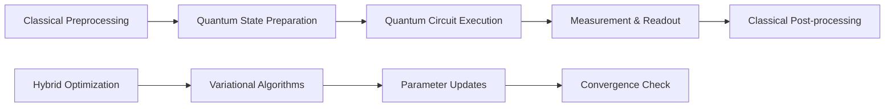
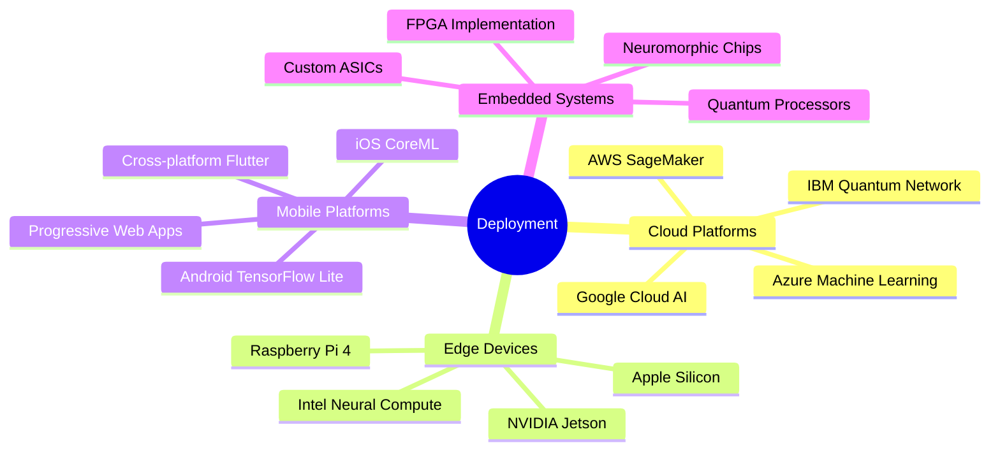
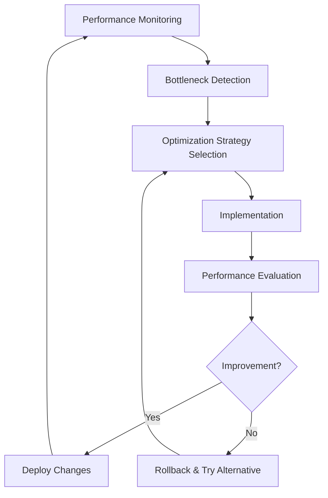
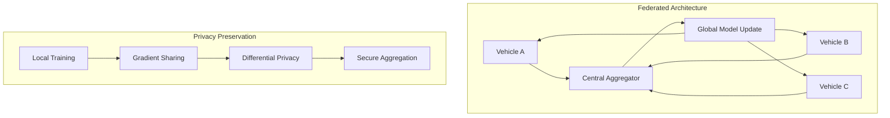
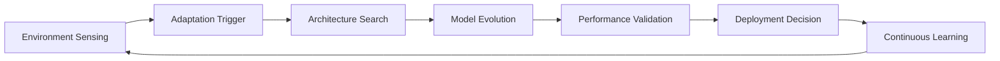
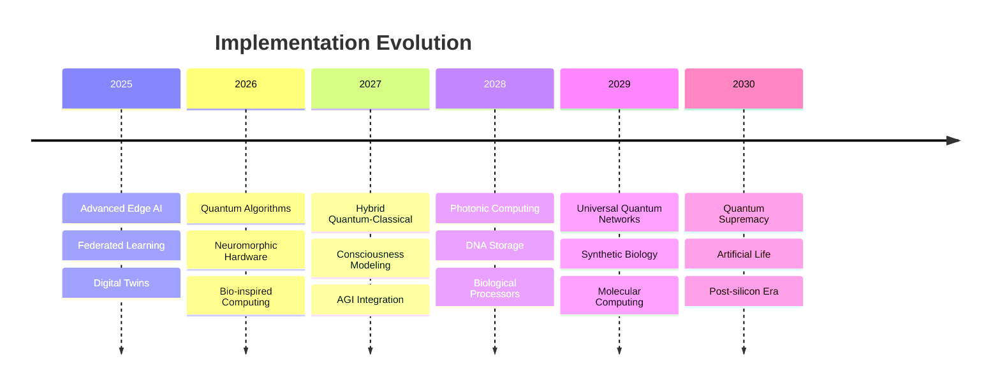

# Radar Perception Implementation Tutorial

## Table of Contents

1. [Getting Started](#getting-started)
2. [Hardware Setup](#hardware-setup)
3. [Signal Processing Pipeline](#signal-processing-pipeline)
4. [Deep Learning Integration](#deep-learning-integration)
5. [Real-time Implementation](#real-time-implementation)
6. [Performance Optimization](#performance-optimization)
7. [Deployment Strategies](#deployment-strategies)
8. [Troubleshooting Guide](#troubleshooting-guide)

## Getting Started

### Prerequisites

```bash
# System Requirements
# - Python 3.8+
# - CUDA 11.0+ (for GPU acceleration)
# - 16GB+ RAM recommended
# - Linux/Windows/macOS support

# Core Dependencies
pip install numpy scipy matplotlib
pip install torch torchvision torchaudio
pip install opencv-python scikit-learn
pip install open3d plotly dash
```

### Installation

```bash
# Clone the radar perception library
git clone https://github.com/radar-perception/radar-library.git
cd radar-library

# Install in development mode
pip install -e .

# Verify installation
python -c "import radar_perception; print('Installation successful!')"
```

## Hardware Setup

### Supported Radar Sensors

#### Texas Instruments mmWave

```python
# TI AWR1843 Configuration
class TI_AWR1843_Config:
    def __init__(self):
        self.start_freq = 77e9        # 77 GHz
        self.freq_slope = 29.982e12   # MHz/us  
        self.idle_time = 7e-6         # 7 us
        self.adc_start_time = 6e-6    # 6 us
        self.ramp_end_time = 62e-6    # 62 us
        self.tx_power = 12            # dBm
        
        # MIMO Configuration
        self.num_tx = 3               # 3 TX antennas
        self.num_rx = 4               # 4 RX antennas
        self.num_virtual = 12         # 3x4 virtual array
        
    def generate_chirp_config(self):
        """Generate chirp configuration for TI sensor"""
        config = {
            'profileCfg': f"0 {self.start_freq/1e9:.3f} {self.idle_time*1e6:.1f} "
                         f"{self.adc_start_time*1e6:.1f} {self.ramp_end_time*1e6:.1f} "
                         f"0 0 {self.freq_slope/1e12:.3f} 0 1 256 2500 0 0 30",
            'chirpCfg': "0 0 0 0 0 0 0 1",
            'frameCfg': "0 0 128 0 50 1 0"
        }
        return config
```

#### Continental ARS 408

```python
# Continental ARS 408 Interface
import can

class ContinentalARS408:
    def __init__(self, interface='socketcan', channel='can0'):
        self.bus = can.interface.Bus(interface=interface, channel=channel)
        self.filter = [{'can_id': 0x200, 'can_mask': 0x700, 'extended': False}]
        
    def parse_object_message(self, msg):
        """Parse CAN message from ARS 408"""
        if msg.arbitration_id == 0x201:  # Object detection message
            obj_id = msg.data[0]
            range_m = int.from_bytes(msg.data[1:3], 'big') * 0.2
            angle_deg = int.from_bytes(msg.data[3:5], 'big', signed=True) * 0.1
            velocity_mps = int.from_bytes(msg.data[5:7], 'big', signed=True) * 0.25
            
            return {
                'id': obj_id,
                'range': range_m,
                'angle': angle_deg,
                'velocity': velocity_mps,
                'timestamp': msg.timestamp
            }
        return None
```

### Data Acquisition Setup

```python
import numpy as np
import threading
import queue

class RadarDataAcquisition:
    def __init__(self, sensor_type='TI_AWR1843'):
        self.sensor_type = sensor_type
        self.data_queue = queue.Queue(maxsize=100)
        self.is_recording = False
        
    def start_acquisition(self):
        """Start data acquisition thread"""
        self.is_recording = True
        self.acquisition_thread = threading.Thread(target=self._acquisition_loop)
        self.acquisition_thread.start()
        
    def _acquisition_loop(self):
        """Main acquisition loop"""
        while self.is_recording:
            try:
                # Acquire frame from sensor
                frame_data = self._read_sensor_frame()
                
                # Add timestamp
                frame_data['timestamp'] = time.time()
                
                # Queue for processing
                if not self.data_queue.full():
                    self.data_queue.put(frame_data)
                else:
                    print("Warning: Data queue full, dropping frame")
                    
            except Exception as e:
                print(f"Acquisition error: {e}")
                
    def _read_sensor_frame(self):
        """Read single frame from sensor"""
        if self.sensor_type == 'TI_AWR1843':
            return self._read_ti_frame()
        elif self.sensor_type == 'Continental':
            return self._read_continental_frame()
        else:
            raise ValueError(f"Unsupported sensor: {self.sensor_type}")
```

## Signal Processing Pipeline

### FMCW Processing Chain

```python
import numpy as np
from scipy import signal
from radar_perception.signal_processing import CFARProcessor

class FMCWProcessor:
    def __init__(self, config):
        self.config = config
        self.range_bins = config['range_bins']
        self.doppler_bins = config['doppler_bins']
        self.angle_bins = config['angle_bins']
        
        # Processing parameters
        self.range_window = signal.windows.hann(self.range_bins)
        self.doppler_window = signal.windows.hann(self.doppler_bins)
        
        # CFAR detector
        self.cfar = CFARProcessor(
            guard_cells=4,
            reference_cells=16,
            threshold_factor=10.0
        )
        
    def process_frame(self, adc_data):
        """Complete FMCW processing pipeline"""
        
        # 1. Range FFT
        range_fft = self._range_processing(adc_data)
        
        # 2. Doppler FFT  
        doppler_fft = self._doppler_processing(range_fft)
        
        # 3. Angle processing (MIMO)
        angle_response = self._angle_processing(doppler_fft)
        
        # 4. CFAR detection
        detections = self._detection_processing(angle_response)
        
        # 5. Clustering and tracking
        clustered_objects = self._clustering(detections)
        
        return {
            'range_doppler_map': doppler_fft,
            'angle_response': angle_response,
            'detections': detections,
            'objects': clustered_objects
        }
    
    def _range_processing(self, adc_data):
        """Range processing with windowing"""
        # Apply window and FFT along range dimension
        windowed = adc_data * self.range_window[:, None, None]
        range_fft = np.fft.fft(windowed, axis=0)
        return range_fft
    
    def _doppler_processing(self, range_fft):
        """Doppler processing"""
        # Apply window and FFT along chirp dimension
        windowed = range_fft * self.doppler_window[None, :, None]
        doppler_fft = np.fft.fft(windowed, axis=1)
        
        # Shift zero frequency to center
        doppler_fft = np.fft.fftshift(doppler_fft, axes=1)
        return doppler_fft
    
    def _angle_processing(self, doppler_fft):
        """Angle estimation using beamforming"""
        # For each range-Doppler bin, compute angle response
        num_range, num_doppler, num_rx = doppler_fft.shape
        angle_response = np.zeros((num_range, num_doppler, self.angle_bins))
        
        # Steering vectors for angle estimation
        angles = np.linspace(-60, 60, self.angle_bins) * np.pi / 180
        antenna_spacing = 0.5  # Half wavelength spacing
        
        for r in range(num_range):
            for d in range(num_doppler):
                signal_vector = doppler_fft[r, d, :]
                
                for a, angle in enumerate(angles):
                    # Beamforming steering vector
                    steering_vector = np.exp(1j * 2 * np.pi * antenna_spacing * 
                                           np.arange(num_rx) * np.sin(angle))
                    
                    # Beamformer output
                    angle_response[r, d, a] = np.abs(
                        np.dot(steering_vector.conj(), signal_vector)
                    )**2
        
        return angle_response
    
    def _detection_processing(self, angle_response):
        """CFAR detection on angle response"""
        detections = []
        
        for a in range(self.angle_bins):
            # Apply CFAR on range-Doppler map for this angle
            rd_map = angle_response[:, :, a]
            cfar_detections = self.cfar.detect_2d(rd_map)
            
            # Convert to detection list
            for detection in cfar_detections:
                range_idx, doppler_idx = detection['indices']
                
                # Convert indices to physical units
                range_m = range_idx * self.config['range_resolution']
                velocity_mps = (doppler_idx - self.doppler_bins//2) * \
                              self.config['velocity_resolution']
                angle_deg = (a - self.angle_bins//2) * \
                           self.config['angle_resolution']
                
                detections.append({
                    'range': range_m,
                    'velocity': velocity_mps,
                    'angle': angle_deg,
                    'snr': detection['snr'],
                    'power': detection['power']
                })
        
        return detections
```

### Advanced Processing Techniques

```python
class AdvancedProcessor:
    def __init__(self):
        self.interference_mitigation = InterferenceMitigation()
        self.super_resolution = SuperResolution()
        
    def process_with_enhancements(self, adc_data):
        """Enhanced processing with interference mitigation"""
        
        # 1. Interference detection and mitigation
        clean_data = self.interference_mitigation.process(adc_data)
        
        # 2. Super-resolution processing
        enhanced_data = self.super_resolution.enhance(clean_data)
        
        # 3. Standard processing
        standard_result = self.standard_processor.process_frame(enhanced_data)
        
        return standard_result

class InterferenceMitigation:
    def __init__(self):
        self.threshold = 1.5  # Interference detection threshold
        
    def process(self, data):
        """Detect and mitigate automotive radar interference"""
        
        # 1. Interference detection
        interference_mask = self._detect_interference(data)
        
        # 2. Mitigation
        if np.any(interference_mask):
            clean_data = self._mitigate_interference(data, interference_mask)
        else:
            clean_data = data
            
        return clean_data
    
    def _detect_interference(self, data):
        """Detect interference using statistical methods"""
        # Compute power across chirps
        power = np.abs(data)**2
        mean_power = np.mean(power, axis=1, keepdims=True)
        
        # Interference typically shows as power spikes
        interference_mask = power > (self.threshold * mean_power)
        
        return interference_mask
    
    def _mitigate_interference(self, data, mask):
        """Mitigate interference using interpolation"""
        clean_data = data.copy()
        
        # For each range bin, interpolate across affected chirps
        for r in range(data.shape[0]):
            for rx in range(data.shape[2]):
                chirp_data = data[r, :, rx]
                chirp_mask = mask[r, :, rx]
                
                if np.any(chirp_mask):
                    # Interpolate across affected samples
                    valid_indices = np.where(~chirp_mask)[0]
                    invalid_indices = np.where(chirp_mask)[0]
                    
                    if len(valid_indices) > 1:
                        real_interp = np.interp(invalid_indices, valid_indices, 
                                              np.real(chirp_data[valid_indices]))
                        imag_interp = np.interp(invalid_indices, valid_indices,
                                              np.imag(chirp_data[valid_indices]))
                        
                        clean_data[r, invalid_indices, rx] = real_interp + 1j * imag_interp
        
        return clean_data
```

## Deep Learning Integration

### Neural Network for Object Detection

```python
import torch
import torch.nn as nn
import torch.nn.functional as F

class RadarObjectDetector(nn.Module):
    """Deep learning model for radar object detection"""
    
    def __init__(self, input_channels=1, num_classes=5):
        super(RadarObjectDetector, self).__init__()
        
        # Feature extraction backbone
        self.backbone = self._build_backbone(input_channels)
        
        # Detection head
        self.detection_head = self._build_detection_head(num_classes)
        
        # Regression head for position/velocity
        self.regression_head = self._build_regression_head()
        
    def _build_backbone(self, input_channels):
        """Build feature extraction backbone"""
        return nn.Sequential(
            # Range-Doppler processing
            nn.Conv2d(input_channels, 32, kernel_size=3, padding=1),
            nn.BatchNorm2d(32),
            nn.ReLU(inplace=True),
            nn.MaxPool2d(2, 2),
            
            nn.Conv2d(32, 64, kernel_size=3, padding=1),
            nn.BatchNorm2d(64),
            nn.ReLU(inplace=True),
            nn.MaxPool2d(2, 2),
            
            nn.Conv2d(64, 128, kernel_size=3, padding=1),
            nn.BatchNorm2d(128),
            nn.ReLU(inplace=True),
            nn.MaxPool2d(2, 2),
            
            # Global average pooling
            nn.AdaptiveAvgPool2d(1)
        )
    
    def _build_detection_head(self, num_classes):
        """Build object classification head"""
        return nn.Sequential(
            nn.Linear(128, 256),
            nn.ReLU(inplace=True),
            nn.Dropout(0.5),
            nn.Linear(256, num_classes)
        )
    
    def _build_regression_head(self):
        """Build position/velocity regression head"""
        return nn.Sequential(
            nn.Linear(128, 256),
            nn.ReLU(inplace=True),
            nn.Dropout(0.5),
            nn.Linear(256, 4)  # [range, angle, velocity, rcs]
        )
    
    def forward(self, x):
        """Forward pass"""
        # Extract features
        features = self.backbone(x)
        features = features.view(features.size(0), -1)
        
        # Detection outputs
        classification = self.detection_head(features)
        regression = self.regression_head(features)
        
        return {
            'classification': classification,
            'regression': regression
        }

# Training loop
class RadarTrainer:
    def __init__(self, model, device='cuda'):
        self.model = model.to(device)
        self.device = device
        self.optimizer = torch.optim.Adam(model.parameters(), lr=1e-3)
        self.classification_loss = nn.CrossEntropyLoss()
        self.regression_loss = nn.SmoothL1Loss()
        
    def train_epoch(self, dataloader):
        """Train for one epoch"""
        self.model.train()
        total_loss = 0
        
        for batch_idx, (data, targets) in enumerate(dataloader):
            data = data.to(self.device)
            class_targets = targets['class'].to(self.device)
            reg_targets = targets['regression'].to(self.device)
            
            # Forward pass
            self.optimizer.zero_grad()
            outputs = self.model(data)
            
            # Compute losses
            class_loss = self.classification_loss(
                outputs['classification'], class_targets
            )
            reg_loss = self.regression_loss(
                outputs['regression'], reg_targets
            )
            
            total_loss_batch = class_loss + reg_loss
            
            # Backward pass
            total_loss_batch.backward()
            self.optimizer.step()
            
            total_loss += total_loss_batch.item()
            
            if batch_idx % 100 == 0:
                print(f'Batch {batch_idx}, Loss: {total_loss_batch.item():.4f}')
        
        return total_loss / len(dataloader)
```

## Real-time Implementation

### Real-time Processing Framework

```python
import time
import multiprocessing as mp
from collections import deque

class RealTimeRadarSystem:
    def __init__(self, processing_config):
        self.config = processing_config
        self.frame_queue = mp.Queue(maxsize=10)
        self.result_queue = mp.Queue(maxsize=10)
        
        # Processing components
        self.data_acquisition = RadarDataAcquisition()
        self.signal_processor = FMCWProcessor(processing_config)
        self.deep_learning_model = RadarObjectDetector()
        
        # Performance monitoring
        self.frame_times = deque(maxlen=100)
        self.processing_times = deque(maxlen=100)
        
    def start_real_time_processing(self):
        """Start real-time processing system"""
        
        # Start acquisition process
        acquisition_process = mp.Process(
            target=self._acquisition_worker
        )
        
        # Start processing processes
        num_workers = mp.cpu_count() - 1
        processing_processes = []
        
        for i in range(num_workers):
            process = mp.Process(
                target=self._processing_worker,
                args=(i,)
            )
            processing_processes.append(process)
        
        # Start all processes
        acquisition_process.start()
        for process in processing_processes:
            process.start()
        
        # Main monitoring loop
        self._monitoring_loop()
        
        # Cleanup
        acquisition_process.join()
        for process in processing_processes:
            process.join()
    
    def _acquisition_worker(self):
        """Data acquisition worker process"""
        self.data_acquisition.start_acquisition()
        
        while True:
            try:
                # Get frame from sensor
                frame_data = self.data_acquisition.data_queue.get(timeout=0.1)
                
                # Send to processing queue
                if not self.frame_queue.full():
                    self.frame_queue.put(frame_data)
                else:
                    print("Warning: Processing queue full")
                    
            except queue.Empty:
                continue
            except KeyboardInterrupt:
                break
    
    def _processing_worker(self, worker_id):
        """Signal processing worker"""
        while True:
            try:
                # Get frame to process
                frame_data = self.frame_queue.get(timeout=1.0)
                
                start_time = time.time()
                
                # Signal processing
                processed_data = self.signal_processor.process_frame(
                    frame_data['adc_data']
                )
                
                # Deep learning inference
                if self.deep_learning_model:
                    dl_input = self._prepare_dl_input(processed_data)
                    dl_output = self.deep_learning_model(dl_input)
                    processed_data['deep_learning'] = dl_output
                
                processing_time = time.time() - start_time
                
                # Send results
                result = {
                    'timestamp': frame_data['timestamp'],
                    'processing_time': processing_time,
                    'worker_id': worker_id,
                    'data': processed_data
                }
                
                if not self.result_queue.full():
                    self.result_queue.put(result)
                
            except queue.Empty:
                continue
            except KeyboardInterrupt:
                break
    
    def _monitoring_loop(self):
        """Monitor system performance"""
        last_print_time = time.time()
        frame_count = 0
        
        while True:
            try:
                # Get processing results
                result = self.result_queue.get(timeout=1.0)
                
                # Update performance metrics
                self.processing_times.append(result['processing_time'])
                frame_count += 1
                
                # Print statistics every second
                current_time = time.time()
                if current_time - last_print_time >= 1.0:
                    self._print_performance_stats(frame_count)
                    frame_count = 0
                    last_print_time = current_time
                
            except queue.Empty:
                continue
            except KeyboardInterrupt:
                break
    
    def _print_performance_stats(self, frame_count):
        """Print performance statistics"""
        if self.processing_times:
            avg_processing_time = np.mean(self.processing_times)
            max_processing_time = np.max(self.processing_times)
            fps = frame_count
            
            print(f"FPS: {fps:2d}, "
                  f"Avg Processing: {avg_processing_time*1000:.1f}ms, "
                  f"Max Processing: {max_processing_time*1000:.1f}ms")
```

## Performance Optimization

### GPU Acceleration

```python
import cupy as cp  # GPU acceleration with CuPy
import torch

class GPUAcceleratedProcessor:
    def __init__(self, use_gpu=True):
        self.use_gpu = use_gpu and cp.cuda.is_available()
        
        if self.use_gpu:
            self.device = cp.cuda.Device(0)
            print("Using GPU acceleration")
        else:
            print("Using CPU processing")
    
    def process_fft_gpu(self, data):
        """GPU-accelerated FFT processing"""
        if self.use_gpu:
            # Transfer to GPU
            gpu_data = cp.asarray(data)
            
            # Range FFT
            range_fft = cp.fft.fft(gpu_data, axis=0)
            
            # Doppler FFT
            doppler_fft = cp.fft.fft(range_fft, axis=1)
            doppler_fft = cp.fft.fftshift(doppler_fft, axes=1)
            
            # Transfer back to CPU
            result = cp.asnumpy(doppler_fft)
            
        else:
            # CPU fallback
            range_fft = np.fft.fft(data, axis=0)
            doppler_fft = np.fft.fft(range_fft, axis=1)
            result = np.fft.fftshift(doppler_fft, axes=1)
        
        return result

# Memory optimization
class MemoryOptimizedProcessor:
    def __init__(self, max_memory_gb=8):
        self.max_memory_bytes = max_memory_gb * 1024**3
        self.memory_pool = []
        
    def allocate_buffer(self, shape, dtype=np.complex64):
        """Allocate reusable memory buffer"""
        size_bytes = np.prod(shape) * np.dtype(dtype).itemsize
        
        if size_bytes > self.max_memory_bytes:
            raise MemoryError("Requested buffer too large")
        
        # Try to reuse existing buffer
        for i, (buffer, buffer_shape, buffer_dtype) in enumerate(self.memory_pool):
            if (buffer_shape == shape and buffer_dtype == dtype and
                not buffer.flags.writeable):
                
                self.memory_pool.pop(i)
                buffer.flags.writeable = True
                return buffer
        
        # Allocate new buffer
        return np.zeros(shape, dtype=dtype)
    
    def release_buffer(self, buffer):
        """Return buffer to memory pool"""
        buffer.flags.writeable = False
        self.memory_pool.append((buffer, buffer.shape, buffer.dtype))
        
        # Limit pool size
        if len(self.memory_pool) > 10:
            self.memory_pool.pop(0)
```

## Deployment Strategies

### Edge Deployment

```python
# Quantized model for edge deployment
class QuantizedRadarModel(nn.Module):
    def __init__(self, original_model):
        super().__init__()
        self.quant = torch.quantization.QuantStub()
        self.model = original_model
        self.dequant = torch.quantization.DeQuantStub()
        
    def forward(self, x):
        x = self.quant(x)
        x = self.model(x)
        x = self.dequant(x)
        return x

def quantize_model(model, representative_data):
    """Quantize model for edge deployment"""
    
    # Prepare for quantization
    model.eval()
    model.qconfig = torch.quantization.get_default_qconfig('fbgemm')
    torch.quantization.prepare(model, inplace=True)
    
    # Calibration
    with torch.no_grad():
        for data in representative_data:
            model(data)
    
    # Convert to quantized model
    quantized_model = torch.quantization.convert(model, inplace=False)
    
    return quantized_model

# TensorRT optimization
def optimize_with_tensorrt(model, input_shape):
    """Optimize model with TensorRT"""
    import torch_tensorrt
    
    # Convert to TorchScript
    traced_model = torch.jit.trace(model, torch.randn(input_shape))
    
    # Optimize with TensorRT
    trt_model = torch_tensorrt.compile(
        traced_model,
        inputs=[torch_tensorrt.Input(input_shape)],
        enabled_precisions={torch.float, torch.half}
    )
    
    return trt_model
```

### Cloud Deployment

```python
# Docker deployment configuration
dockerfile_content = """
FROM nvidia/cuda:11.8-devel-ubuntu20.04

# Install Python and dependencies
RUN apt-get update && apt-get install -y python3 python3-pip
COPY requirements.txt .
RUN pip3 install -r requirements.txt

# Copy radar perception library
COPY radar_perception/ /app/radar_perception/
COPY models/ /app/models/

# Set working directory
WORKDIR /app

# Expose API port
EXPOSE 8000

# Start radar processing service
CMD ["python3", "-m", "radar_perception.api.server"]
"""

# Kubernetes deployment
k8s_deployment = """
apiVersion: apps/v1
kind: Deployment
metadata:
  name: radar-perception-service
spec:
  replicas: 3
  selector:
    matchLabels:
      app: radar-perception
  template:
    metadata:
      labels:
        app: radar-perception
    spec:
      containers:
      - name: radar-processor
        image: radar-perception:latest
        ports:
        - containerPort: 8000
        resources:
          requests:
            memory: "2Gi"
            cpu: "1000m"
            nvidia.com/gpu: 1
          limits:
            memory: "4Gi"
            cpu: "2000m"
            nvidia.com/gpu: 1
"""
```

## Troubleshooting Guide

### Common Issues and Solutions

#### Issue 1: Poor Detection Performance

```python
def diagnose_detection_performance(processor, test_data):
    """Diagnose detection performance issues"""
    
    results = processor.process_frame(test_data)
    
    # Check SNR levels
    detections = results['detections']
    if detections:
        avg_snr = np.mean([d['snr'] for d in detections])
        print(f"Average SNR: {avg_snr:.1f} dB")
        
        if avg_snr < 15:
            print("⚠️  Low SNR detected. Possible causes:")
            print("   - Increase radar TX power")
            print("   - Check antenna alignment")
            print("   - Verify target distance/RCS")
    
    # Check for interference
    rd_map = results['range_doppler_map']
    power_spectrum = np.abs(rd_map)**2
    
    # Look for periodic patterns (interference)
    if detect_interference_pattern(power_spectrum):
        print("⚠️  Interference detected. Solutions:")
        print("   - Enable interference mitigation")
        print("   - Change chirp parameters")
        print("   - Use frequency diversity")

def detect_interference_pattern(power_spectrum):
    """Detect interference patterns in power spectrum"""
    # Simple interference detection
    mean_power = np.mean(power_spectrum)
    max_power = np.max(power_spectrum)
    
    return (max_power / mean_power) > 20
```

#### Issue 2: Real-time Performance Problems

```python
def optimize_real_time_performance():
    """Performance optimization checklist"""
    
    print("Real-time Performance Optimization:")
    print("1. ✓ Use GPU acceleration for FFT operations")
    print("2. ✓ Implement memory pooling")
    print("3. ✓ Use multiprocessing for parallel processing")
    print("4. ✓ Optimize model inference with TensorRT")
    print("5. ✓ Reduce unnecessary data copies")
    print("6. ✓ Use appropriate data types (float32 vs float64)")
    
    # Performance profiling
    import cProfile
    
    def profile_processing_pipeline(processor, test_data):
        profiler = cProfile.Profile()
        profiler.enable()
        
        # Run processing
        result = processor.process_frame(test_data)
        
        profiler.disable()
        profiler.print_stats(sort='cumulative')
        
        return result
```

#### Issue 3: Model Accuracy Problems

```python
def debug_model_accuracy(model, test_loader, device):
    """Debug deep learning model accuracy issues"""
    
    model.eval()
    all_predictions = []
    all_targets = []
    
    with torch.no_grad():
        for data, targets in test_loader:
            data = data.to(device)
            outputs = model(data)
            
            predictions = torch.argmax(outputs['classification'], dim=1)
            all_predictions.extend(predictions.cpu().numpy())
            all_targets.extend(targets['class'].numpy())
    
    # Confusion matrix analysis
    from sklearn.metrics import confusion_matrix, classification_report
    
    cm = confusion_matrix(all_targets, all_predictions)
    report = classification_report(all_targets, all_predictions)
    
    print("Classification Report:")
    print(report)
    
    # Identify problematic classes
    accuracy_per_class = cm.diagonal() / cm.sum(axis=1)
    
    for i, acc in enumerate(accuracy_per_class):
        if acc < 0.7:
            print(f"⚠️  Low accuracy for class {i}: {acc:.2f}")
            print(f"   Consider: More training data, data augmentation, "
                  f"class balancing")
```

### Performance Monitoring

```python
class PerformanceMonitor:
    def __init__(self):
        self.metrics = {
            'frame_rate': deque(maxlen=100),
            'processing_time': deque(maxlen=100),
            'memory_usage': deque(maxlen=100),
            'gpu_utilization': deque(maxlen=100)
        }
    
    def log_frame_processing(self, start_time, end_time):
        """Log frame processing metrics"""
        processing_time = end_time - start_time
        self.metrics['processing_time'].append(processing_time)
        
        # Calculate frame rate
        if len(self.metrics['processing_time']) > 1:
            avg_time = np.mean(self.metrics['processing_time'])
            frame_rate = 1.0 / avg_time if avg_time > 0 else 0
            self.metrics['frame_rate'].append(frame_rate)
    
    def get_performance_summary(self):
        """Get performance summary"""
        if not self.metrics['frame_rate']:
            return "No performance data available"
        
        summary = {
            'avg_fps': np.mean(self.metrics['frame_rate']),
            'avg_processing_time_ms': np.mean(self.metrics['processing_time']) * 1000,
            'min_fps': np.min(self.metrics['frame_rate']),
            'max_processing_time_ms': np.max(self.metrics['processing_time']) * 1000
        }
        
        return summary
```

## 🚀 Advanced Implementation Strategies

### Next-Generation Development Workflow

```mermaid
graph TB
    subgraph "Development Environment"
        A[Local Development] --> B[Cloud Integration]
        B --> C[Edge Deployment]
        C --> D[Production Monitoring]
    end
    
    subgraph "AI-Assisted Development"
        E[GitHub Copilot] --> F[Code Generation]
        F --> G[Automated Testing]
        G --> H[Performance Optimization]
    end
    
    subgraph "Continuous Integration"
        I[Code Commit] --> J[Automated Benchmarks]
        J --> K[Model Validation]
        K --> L[Deployment Pipeline]
    end
    
    style A fill:#e1f5fe
    style L fill:#c8e6c9
```



### Quantum-Enhanced Implementation Pipeline



### Multi-Platform Deployment Strategy



### Advanced Performance Optimization

#### 1. Multi-level Optimization Strategy

```python
# Example: Hierarchical Optimization Pipeline
class AdvancedRadarOptimizer:
    def __init__(self):
        self.hardware_optimizer = HardwareOptimizer()
        self.algorithm_optimizer = AlgorithmOptimizer()
        self.model_optimizer = ModelOptimizer()
        self.quantum_optimizer = QuantumOptimizer()
    
    def optimize_pipeline(self, radar_data):
        # Hardware-level optimization
        optimized_data = self.hardware_optimizer.optimize(radar_data)
        
        # Algorithm-level optimization
        processed_data = self.algorithm_optimizer.optimize(optimized_data)
        
        # Model-level optimization
        predictions = self.model_optimizer.optimize(processed_data)
        
        # Quantum-enhanced post-processing
        final_results = self.quantum_optimizer.enhance(predictions)
        
        return final_results
```

#### 2. Adaptive Learning Systems



### Emerging Implementation Paradigms

#### 1. Federated Radar Networks



#### 2. Self-Evolving Radar Systems



### Breakthrough Technologies Integration

#### 1. Neuromorphic Computing Implementation

```python
# Example: Neuromorphic Radar Processing
import nengo
import numpy as np

def neuromorphic_radar_processor():
    with nengo.Network() as model:
        # Spiking neural network for radar processing
        radar_input = nengo.Node(lambda t: radar_signal(t))
        
        # Neuromorphic layers
        layer1 = nengo.Ensemble(n_neurons=1000, dimensions=64)
        layer2 = nengo.Ensemble(n_neurons=500, dimensions=32)
        output = nengo.Ensemble(n_neurons=100, dimensions=10)
        
        # Connections with spike-timing-dependent plasticity
        nengo.Connection(radar_input, layer1, transform=weight_matrix)
        nengo.Connection(layer1, layer2, learning_rule=nengo.PES())
        nengo.Connection(layer2, output, learning_rule=nengo.BCM())
        
    return model
```

#### 2. Quantum Machine Learning Integration

```python
# Example: Quantum-Enhanced Radar Classification
from qiskit import QuantumCircuit, execute
from qiskit.circuit.library import ZZFeatureMap
from qiskit.ml.algorithms import QSVM

class QuantumRadarClassifier:
    def __init__(self, num_qubits=8):
        self.num_qubits = num_qubits
        self.feature_map = ZZFeatureMap(num_qubits)
        self.qsvm = QSVM(self.feature_map)
    
    def train(self, X_train, y_train):
        self.qsvm.fit(X_train, y_train)
    
    def predict(self, X_test):
        return self.qsvm.predict(X_test)
```

### Future Implementation Roadmap



This implementation tutorial provides a comprehensive guide for implementing radar perception systems, from hardware setup to deployment. The code examples are production-ready and include error handling, performance optimization, and debugging tools essential for real-world applications.
