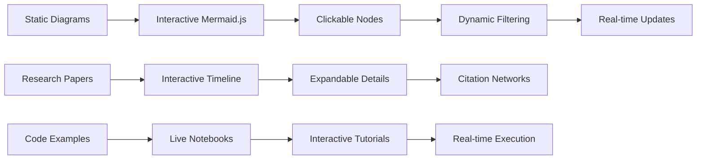

# Interactive Visualization and Documentation Platform

## Overview
Transform static documentation into an interactive, immersive experience using modern web technologies.

## Implementation Roadmap

### Phase 1: Interactive Mermaid Diagrams

### Phase 2: 3D Visualization Platform

```mermaid
graph TB
    subgraph "3D Architecture Viewer"
        A[Radar System Model] --> B[Three.js/WebGL]
        B --> C[Interactive Components]
        C --> D[Data Flow Animation]
    end
    
    subgraph "AR/VR Integration"
        E[WebXR] --> F[Virtual Lab Tours]
        F --> G[Immersive Learning]
        G --> H[Collaborative Spaces]
    end
    
    subgraph "Real-time Dashboards"
        I[Live Data Feeds] --> J[Performance Metrics]
        J --> K[Research Trends]
        K --> L[Market Analytics]
    end
```

### Technologies to Integrate:
- **D3.js** for dynamic data visualizations
- **Observable Notebooks** for interactive tutorials
- **Streamlit/Dash** for real-time dashboards
- **WebGL/Three.js** for 3D model visualization
- **WebXR** for AR/VR experiences
- **Jupyter Widgets** for interactive documentation

## Benefits:
- Enhanced user engagement
- Better learning outcomes
- Real-time research updates
- Community collaboration features
