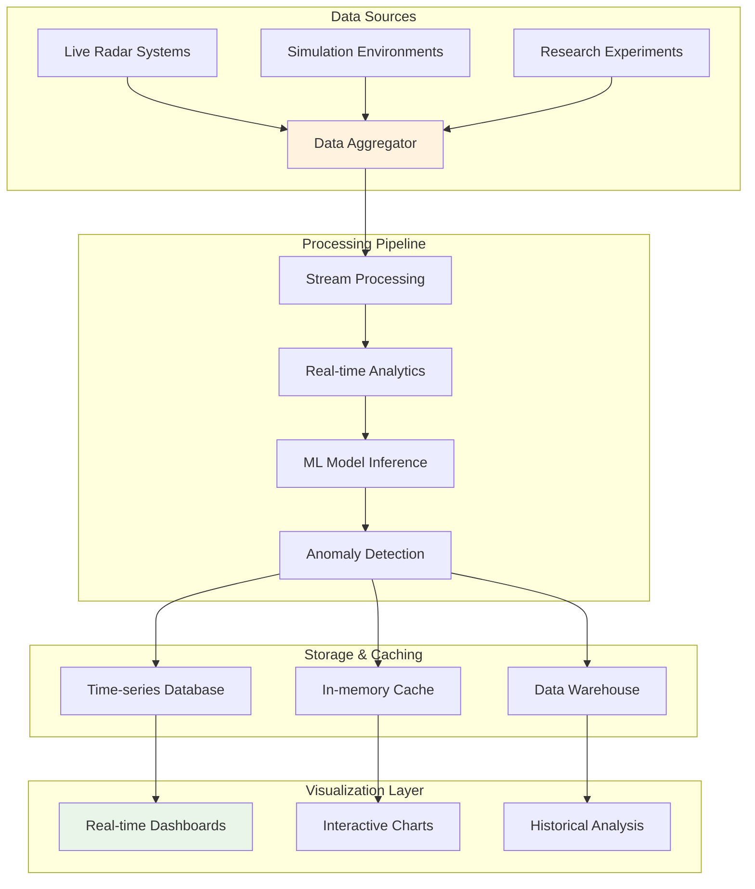
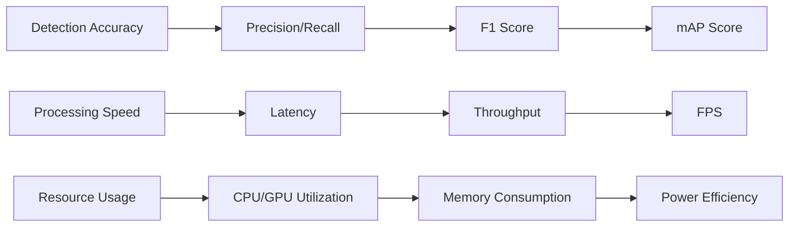
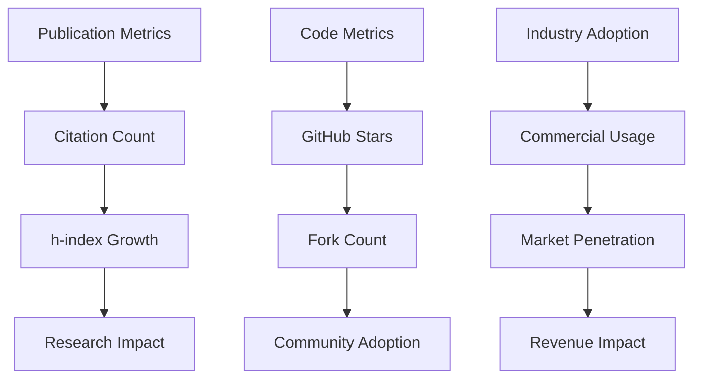
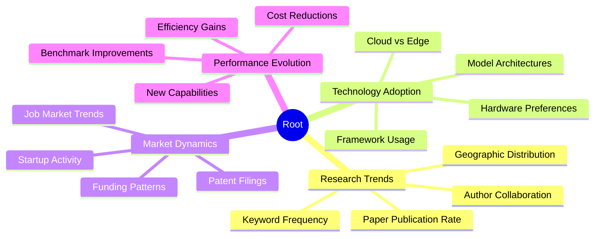
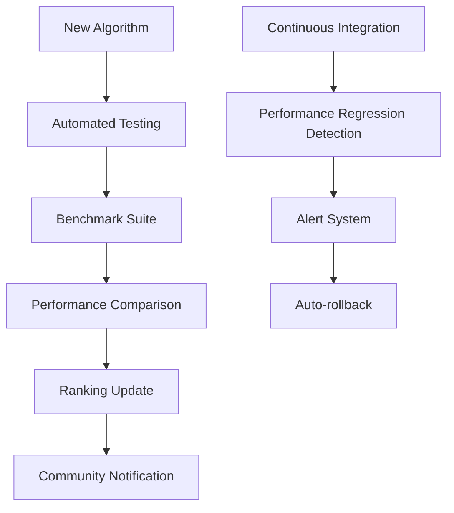
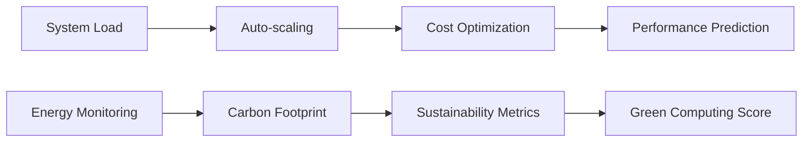
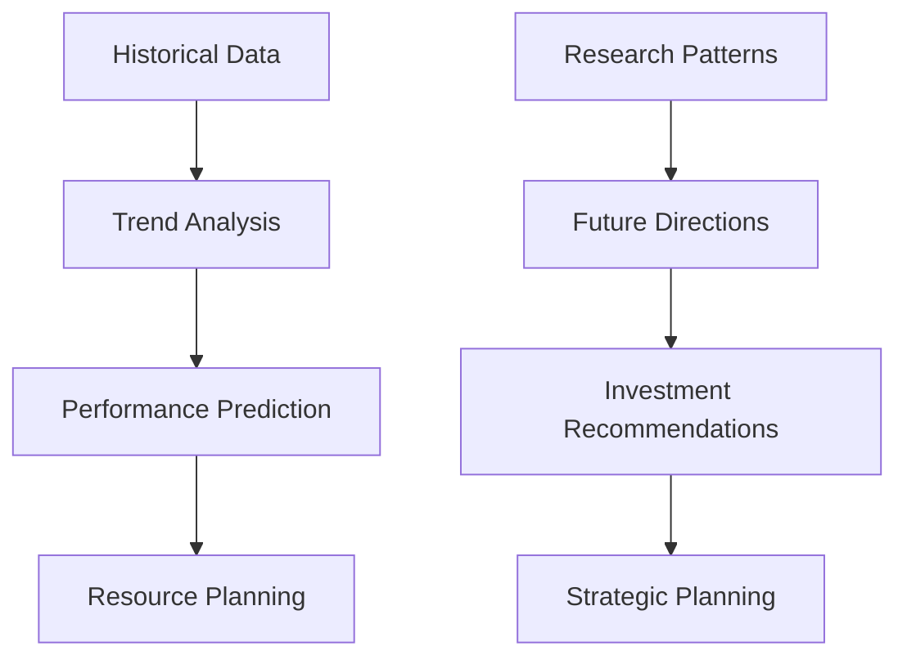
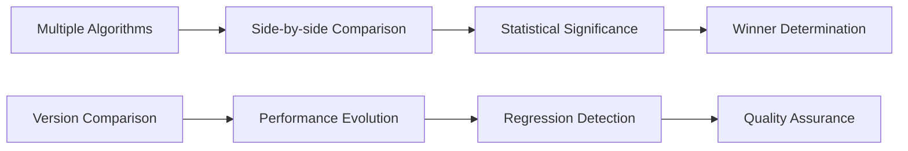

# Real-Time Performance Monitoring and Analytics

## Comprehensive Performance Dashboard

### System Architecture

### Key Performance Indicators (KPIs)

#### 1. Algorithm Performance Metrics

#### 2. Research Impact Analytics

#### 3. Technology Trend Analysis

### Real-Time Monitoring Features

#### 1. Live Algorithm Benchmarking

#### 2. Resource Optimization Dashboard

### Implementation Stack

- **Time-series Database**: InfluxDB or TimescaleDB
- **Stream Processing**: Apache Kafka + Apache Flink
- **Visualization**: Grafana, Plotly Dash, or custom React dashboards
- **ML Pipeline**: MLflow for experiment tracking
- **Alerting**: PagerDuty or custom notification system
- **API**: GraphQL for flexible data queries

### Advanced Analytics Features

#### 1. Predictive Analytics

#### 2. Comparative Analysis

### Benefits

- Real-time performance insights
- Automated benchmarking and comparison
- Predictive maintenance and optimization
- Research trend identification
- Community engagement metrics
- Investment decision support
