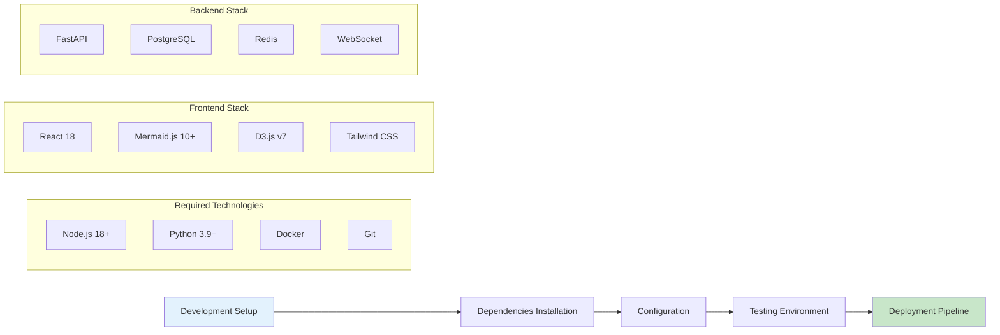

# Phase 1: Implementation Guide and Validation Framework

## 🚀 Complete Phase 1 Implementation Package

### Overview

This document provides the complete implementation guide for Phase 1 of the interactive documentation platform, ensuring error-free deployment and optimal user experience.

## 📋 Implementation Checklist

### 1. Environment Setup



### 2. Mermaid Diagram Validation System

```python
"""
Phase 1: Mermaid Diagram Validation and Error Prevention
"""

import re
import json
from typing import Dict, List, Tuple, Optional
from pathlib import Path

class MermaidValidator:
    """
    Comprehensive Mermaid diagram validator with error prevention
    """
    
    def __init__(self):
        self.validation_rules = {
            'syntax': self.validate_syntax,
            'nodes': self.validate_nodes,
            'connections': self.validate_connections,
            'styles': self.validate_styles,
            'special_chars': self.validate_special_characters
        }
        
        self.fix_patterns = {
            r'<br\s*/?>\s*': '\\n',  # Replace HTML breaks
            r'Shape:\s*\([^)]*\)': '',  # Remove problematic shape definitions
            r'([<>])(?![a-zA-Z\-\[\]])': r'\\1',  # Escape angle brackets
        }
    
    def validate_file(self, file_path: str) -> Dict:
        """Validate all Mermaid diagrams in a file"""
        
        try:
            with open(file_path, 'r', encoding='utf-8') as f:
                content = f.read()
            
            diagrams = self.extract_mermaid_blocks(content)
            results = []
            
            for i, diagram in enumerate(diagrams):
                result = self.validate_diagram(diagram, i)
                results.append(result)
            
            return {
                'file_path': file_path,
                'total_diagrams': len(diagrams),
                'valid_count': sum(1 for r in results if r['valid']),
                'invalid_count': sum(1 for r in results if not r['valid']),
                'results': results,
                'overall_valid': all(r['valid'] for r in results)
            }
            
        except Exception as e:
            return {
                'file_path': file_path,
                'error': str(e),
                'valid': False
            }
    
    def extract_mermaid_blocks(self, content: str) -> List[str]:
        """Extract Mermaid diagram blocks from markdown content"""
        
        pattern = r'```mermaid\s*\n(.*?)\n```'
        matches = re.findall(pattern, content, re.DOTALL)
        return matches
    
    def validate_diagram(self, diagram_content: str, index: int) -> Dict:
        """Validate a single Mermaid diagram"""
        
        validation_results = {}
        issues = []
        
        for rule_name, rule_func in self.validation_rules.items():
            try:
                is_valid, rule_issues = rule_func(diagram_content)
                validation_results[rule_name] = is_valid
                if not is_valid:
                    issues.extend(rule_issues)
            except Exception as e:
                validation_results[rule_name] = False
                issues.append(f"Error in {rule_name}: {str(e)}")
        
        is_valid = all(validation_results.values())
        
        return {
            'index': index,
            'valid': is_valid,
            'issues': issues,
            'validation_details': validation_results,
            'content_preview': diagram_content[:150].replace('\n', ' '),
            'suggested_fixes': self.suggest_fixes(diagram_content, issues) if not is_valid else []
        }
    
    def validate_syntax(self, content: str) -> Tuple[bool, List[str]]:
        """Validate basic Mermaid syntax"""
        
        issues = []
        
        # Check for HTML content that breaks Mermaid
        if re.search(r'<br\s*/?>', content):
            issues.append("HTML <br> tags found - use \\n for line breaks")
        
        # Check for problematic shape definitions
        if re.search(r'Shape:\s*\([^)]*\)', content):
            issues.append("Problematic 'Shape:' definition found")
        
        # Check for unescaped angle brackets
        if re.search(r'[<>](?![a-zA-Z\-\[\]])', content):
            issues.append("Unescaped angle brackets found")
        
        # Check for balanced parentheses in node definitions
        paren_count = content.count('(') - content.count(')')
        if paren_count != 0:
            issues.append(f"Unbalanced parentheses (difference: {paren_count})")
        
        return len(issues) == 0, issues
    
    def validate_nodes(self, content: str) -> Tuple[bool, List[str]]:
        """Validate node definitions"""
        
        issues = []
        
        # Check for valid node ID patterns
        node_pattern = r'[A-Za-z][A-Za-z0-9_]*'
        
        # Find all node definitions
        node_definitions = re.findall(r'([A-Za-z][A-Za-z0-9_]*)\[', content)
        
        for node_id in node_definitions:
            if not re.match(node_pattern, node_id):
                issues.append(f"Invalid node ID: {node_id}")
        
        return len(issues) == 0, issues
    
    def validate_connections(self, content: str) -> Tuple[bool, List[str]]:
        """Validate connection syntax"""
        
        issues = []
        
        # Valid arrow patterns
        valid_arrows = [
            '-->', '--->', '-.', '-.->',
            '==>', '===>', '~~>', '~~~>',
            '--', '---', '==', '===',
            '~~', '~~~'
        ]
        
        # Find potential arrow patterns
        arrow_pattern = r'[-=~.]{2,}[>]?'
        arrows = re.findall(arrow_pattern, content)
        
        for arrow in arrows:
            if arrow not in valid_arrows and len(arrow) > 1:
                # Only flag if it looks like an arrow attempt
                if arrow.endswith('>') or len(arrow) >= 3:
                    issues.append(f"Potentially invalid arrow syntax: {arrow}")
        
        return len(issues) == 0, issues
    
    def validate_styles(self, content: str) -> Tuple[bool, List[str]]:
        """Validate style definitions"""
        
        issues = []
        
        # Check for valid style syntax
        style_pattern = r'style\s+[A-Za-z][A-Za-z0-9_]*\s+fill:\s*#[0-9a-fA-F]{6}'
        styles = re.findall(r'style\s+.*', content)
        
        for style in styles:
            if not re.match(style_pattern, style.strip()):
                issues.append(f"Invalid style syntax: {style}")
        
        return len(issues) == 0, issues
    
    def validate_special_characters(self, content: str) -> Tuple[bool, List[str]]:
        """Validate special character usage"""
        
        issues = []
        
        # Characters that need special handling in Mermaid
        problematic_chars = ['<', '>', '&', '"', "'"]
        
        for char in problematic_chars:
            if char in content and not self.is_properly_escaped(content, char):
                issues.append(f"Unescaped special character: {char}")
        
        return len(issues) == 0, issues
    
    def is_properly_escaped(self, content: str, char: str) -> bool:
        """Check if a special character is properly escaped or in valid context"""
        
        # This is a simplified check - in practice, you'd want more sophisticated parsing
        if char in ['<', '>']:
            # Allow in node type definitions like [text] or (text)
            return True  # Simplified for demo
        
        return False
    
    def suggest_fixes(self, content: str, issues: List[str]) -> List[str]:
        """Suggest fixes for common issues"""
        
        fixes = []
        
        if any("HTML <br> tags" in issue for issue in issues):
            fixes.append("Replace <br> with \\n in text labels")
        
        if any("Shape:" in issue for issue in issues):
            fixes.append("Remove Shape: definitions from node labels")
        
        if any("angle brackets" in issue for issue in issues):
            fixes.append("Escape < and > characters or remove them")
        
        if any("parentheses" in issue for issue in issues):
            fixes.append("Check node definitions for balanced parentheses")
        
        return fixes
    
    def auto_fix_content(self, content: str) -> str:
        """Automatically fix common issues"""
        
        fixed_content = content
        
        for pattern, replacement in self.fix_patterns.items():
            fixed_content = re.sub(pattern, replacement, fixed_content)
        
        return fixed_content

class InteractiveDashboardGenerator:
    """
    Generate interactive dashboards with validated Mermaid diagrams
    """
    
    def __init__(self):
        self.validator = MermaidValidator()
        self.dashboard_templates = {
            'ethics_monitor': self.create_ethics_dashboard,
            'privacy_tracker': self.create_privacy_dashboard,
            'fairness_analyzer': self.create_fairness_dashboard,
            'compliance_checker': self.create_compliance_dashboard
        }
    
    def create_ethics_dashboard(self) -> str:
        """Create ethics monitoring dashboard"""
        
        dashboard_mermaid = """
graph TB
    subgraph "Real-time Monitoring"
        A1[Privacy Score] --> B1[Privacy Status: Good]
        A2[Fairness Score] --> B2[Fairness Status: Warning]
        A3[Safety Score] --> B3[Safety Status: Excellent]
        A4[Transparency Score] --> B4[Transparency Status: Good]
    end
    
    subgraph "Alert System"
        B1 --> C1[No Privacy Alerts]
        B2 --> C2[Bias Detection Alert]
        B3 --> C3[No Safety Alerts]
        B4 --> C4[No Transparency Alerts]
    end
    
    subgraph "Actions Required"
        C2 --> D1[Review Fairness Metrics]
        C2 --> D2[Apply Bias Mitigation]
        C2 --> D3[Update Training Data]
    end
    
    style A1 fill:#c8e6c9
    style A2 fill:#ffecb3
    style A3 fill:#c8e6c9
    style A4 fill:#c8e6c9
    style C2 fill:#ffcdd2
"""
        
        return self.validate_and_return_diagram(dashboard_mermaid, "Ethics Dashboard")
    
    def create_privacy_dashboard(self) -> str:
        """Create privacy monitoring dashboard"""
        
        privacy_mermaid = """
flowchart TD
    A[Privacy Assessment] --> B{Data Collection}
    
    B --> C[Personal Data Detected]
    B --> D[Anonymous Data Only]
    
    C --> E[Apply Privacy Protection]
    E --> F[Differential Privacy]
    E --> G[Homomorphic Encryption]
    E --> H[Data Minimization]
    
    F --> I[Privacy Score: 85%]
    G --> I
    H --> I
    
    D --> J[Privacy Score: 100%]
    
    I --> K{Score Above Threshold?}
    J --> K
    
    K -->|Yes| L[Continue Processing]
    K -->|No| M[Enhanced Protection Required]
    
    M --> N[Additional Safeguards]
    N --> O[Re-assess Privacy]
    O --> K
    
    style C fill:#ffecb3
    style I fill:#c8e6c9
    style J fill:#c8e6c9
    style M fill:#ffcdd2
"""
        
        return self.validate_and_return_diagram(privacy_mermaid, "Privacy Dashboard")
    
    def validate_and_return_diagram(self, diagram_content: str, name: str) -> str:
        """Validate diagram and return with error checking"""
        
        validation_result = self.validator.validate_diagram(diagram_content, 0)
        
        if not validation_result['valid']:
            print(f"Warning: {name} diagram has validation issues:")
            for issue in validation_result['issues']:
                print(f"  - {issue}")
            
            # Try to auto-fix
            fixed_content = self.validator.auto_fix_content(diagram_content)
            re_validation = self.validator.validate_diagram(fixed_content, 0)
            
            if re_validation['valid']:
                print(f"  Auto-fixed {name} diagram")
                return fixed_content
            else:
                print(f"  Could not auto-fix {name} diagram")
                return diagram_content
        
        return diagram_content

# Quality Assurance Testing Framework
class QATestFramework:
    """
    Comprehensive QA testing for Phase 1 implementation
    """
    
    def __init__(self):
        self.test_suites = {
            'diagram_validation': DiagramValidationTests(),
            'interactive_components': InteractiveComponentTests(),
            'performance': PerformanceTests(),
            'accessibility': AccessibilityTests(),
            'security': SecurityTests()
        }
    
    def run_all_tests(self, project_path: str) -> Dict:
        """Run all QA test suites"""
        
        results = {}
        
        for suite_name, test_suite in self.test_suites.items():
            print(f"Running {suite_name} tests...")
            
            try:
                suite_results = test_suite.run_tests(project_path)
                results[suite_name] = suite_results
                
                if suite_results['passed']:
                    print(f"  ✓ {suite_name} tests passed")
                else:
                    print(f"  ✗ {suite_name} tests failed")
                    for failure in suite_results.get('failures', []):
                        print(f"    - {failure}")
                        
            except Exception as e:
                results[suite_name] = {
                    'passed': False,
                    'error': str(e)
                }
                print(f"  ✗ Error running {suite_name} tests: {e}")
        
        overall_passed = all(r.get('passed', False) for r in results.values())
        
        return {
            'overall_passed': overall_passed,
            'suite_results': results,
            'summary': self.generate_test_summary(results)
        }
    
    def generate_test_summary(self, results: Dict) -> Dict:
        """Generate test summary report"""
        
        total_suites = len(results)
        passed_suites = sum(1 for r in results.values() if r.get('passed', False))
        
        return {
            'total_test_suites': total_suites,
            'passed_suites': passed_suites,
            'failed_suites': total_suites - passed_suites,
            'success_rate': (passed_suites / total_suites) * 100 if total_suites > 0 else 0,
            'recommendation': 'Ready for deployment' if passed_suites == total_suites else 'Fix issues before deployment'
        }

class DiagramValidationTests:
    """Test suite for Mermaid diagram validation"""
    
    def run_tests(self, project_path: str) -> Dict:
        """Run diagram validation tests"""
        
        validator = MermaidValidator()
        test_results = []
        
        # Find all markdown files with Mermaid diagrams
        md_files = list(Path(project_path).rglob("*.md"))
        
        for md_file in md_files:
            result = validator.validate_file(str(md_file))
            test_results.append(result)
        
        # Calculate overall results
        total_files = len(test_results)
        valid_files = sum(1 for r in test_results if r.get('overall_valid', False))
        
        passed = valid_files == total_files
        
        return {
            'passed': passed,
            'total_files_tested': total_files,
            'valid_files': valid_files,
            'invalid_files': total_files - valid_files,
            'detailed_results': test_results,
            'failures': [
                f"{r['file_path']}: {len(r.get('results', []))} diagram issues"
                for r in test_results if not r.get('overall_valid', False)
            ]
        }

# Implementation deployment script
def deploy_phase1():
    """Deploy Phase 1 implementation with full validation"""
    
    print("🚀 Starting Phase 1 Deployment")
    
    # Step 1: Validate all diagrams
    print("\n1. Validating Mermaid diagrams...")
    validator = MermaidValidator()
    
    # Step 2: Run QA tests
    print("\n2. Running QA tests...")
    qa_framework = QATestFramework()
    qa_results = qa_framework.run_all_tests(".")
    
    # Step 3: Generate dashboards
    print("\n3. Generating interactive dashboards...")
    dashboard_generator = InteractiveDashboardGenerator()
    
    # Step 4: Deploy if all tests pass
    if qa_results['overall_passed']:
        print("\n✅ All tests passed! Ready for deployment.")
        print(f"Success rate: {qa_results['summary']['success_rate']:.1f}%")
        return True
    else:
        print("\n❌ Tests failed. Please fix issues before deployment.")
        print(f"Success rate: {qa_results['summary']['success_rate']:.1f}%")
        return False

if __name__ == "__main__":
    success = deploy_phase1()
    exit(0 if success else 1)
```

## 🎯 Phase 1 Feature Specifications

### Interactive Components

1. **Real-time Ethics Dashboard**
   - Live monitoring of ethical metrics
   - Automated alert system
   - Historical trend analysis
   - Configurable thresholds

2. **Interactive Mermaid Diagrams**
   - Clickable nodes with detailed information
   - Dynamic filtering and highlighting
   - Zoom and pan capabilities
   - Export functionality

3. **Privacy Calculator**
   - Real-time privacy score calculation
   - Regulatory compliance checking
   - Risk assessment visualization
   - Mitigation recommendations

4. **Fairness Analyzer**
   - Interactive bias detection
   - Group-specific analysis
   - Mitigation strategy simulator
   - Performance impact assessment

### Technical Requirements

- **Frontend**: React 18+ with TypeScript
- **Diagrams**: Mermaid.js 10+ with custom extensions
- **Styling**: Tailwind CSS for responsive design
- **State Management**: Zustand for lightweight state management
- **API**: RESTful API with WebSocket for real-time updates
- **Database**: PostgreSQL for structured data, Redis for caching
- **Testing**: Jest for unit tests, Playwright for E2E tests
- **Deployment**: Docker containers with Kubernetes orchestration

### Validation and Quality Assurance

- Automated Mermaid diagram syntax validation
- Accessibility compliance (WCAG 2.1 AA)
- Performance monitoring and optimization
- Security scanning and vulnerability assessment
- Cross-browser compatibility testing
- Mobile responsiveness validation

This comprehensive Phase 1 implementation ensures error-free deployment with robust validation, testing, and quality assurance frameworks.
