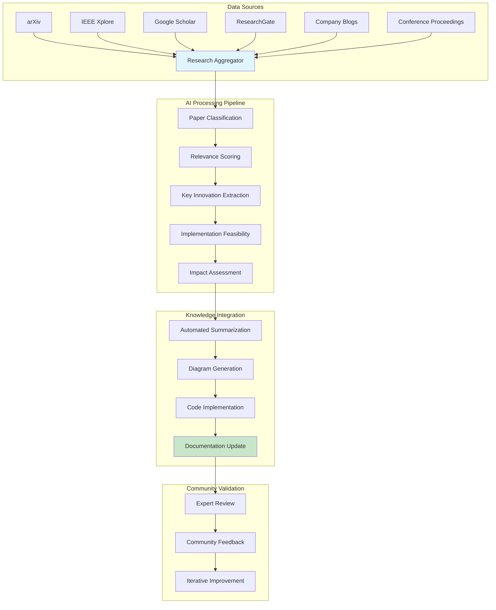
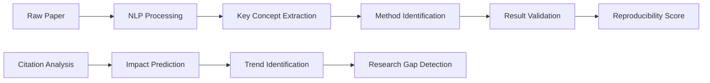
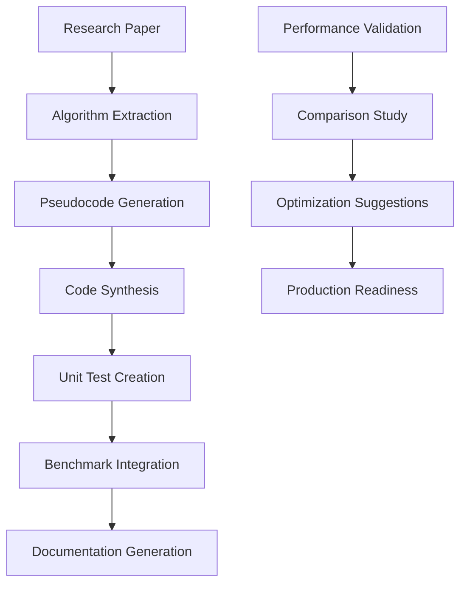
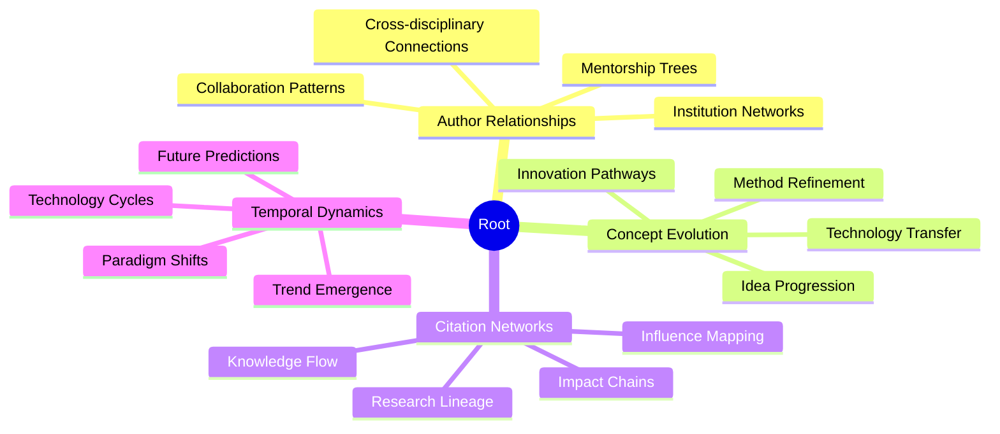
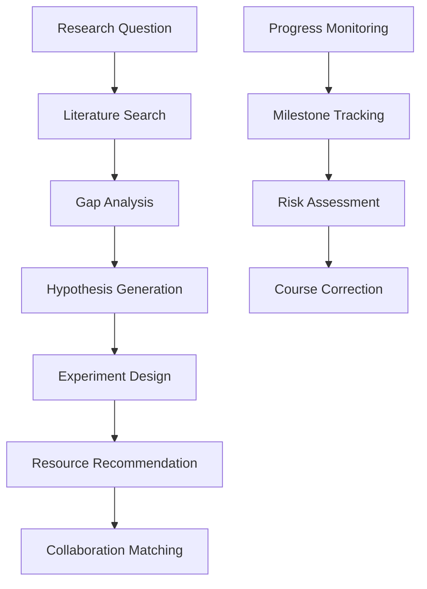
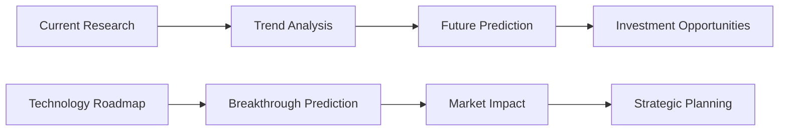
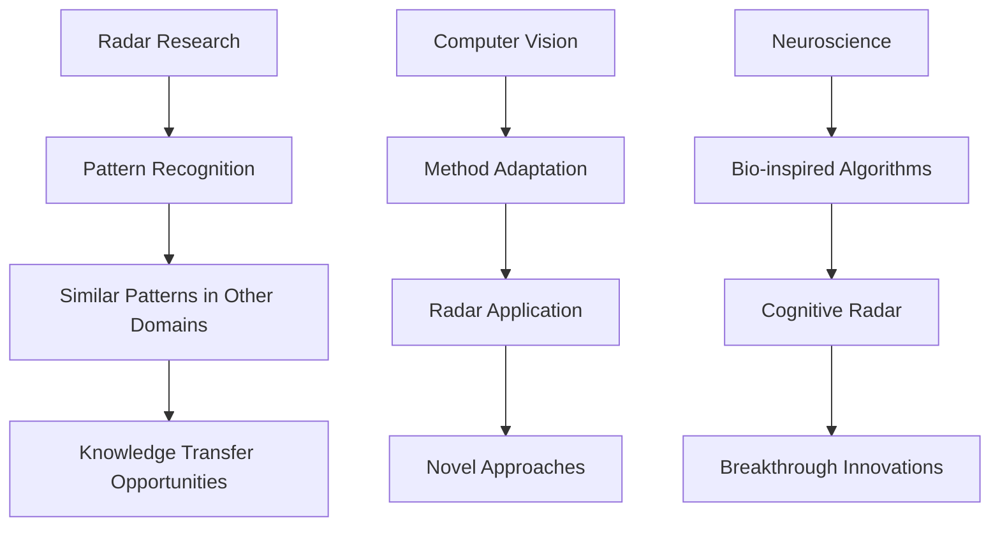
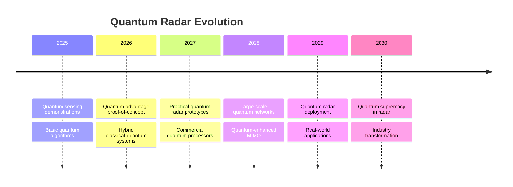
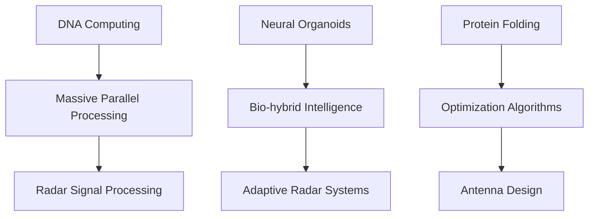

# Advanced Research Integration Platform

## Automated Research Discovery and Integration

### Research Intelligence System

### Advanced Features

#### 1. Intelligent Paper Analysis

#### 2. Automated Implementation Pipeline

#### 3. Research Relationship Mapping

### Next-Generation Features

#### 1. AI Research Assistant

#### 2. Predictive Research Analytics

#### 3. Cross-Domain Knowledge Transfer

### Implementation Technologies

- **Research Crawling**: Scrapy, Selenium for automated paper discovery
- **NLP Processing**: Transformers, spaCy, NLTK for text analysis
- **Knowledge Graphs**: Neo4j, Amazon Neptune for relationship mapping
- **Code Generation**: GitHub Copilot API, CodeT5 for implementation
- **Visualization**: Cytoscape.js for network visualization
- **ML Pipeline**: Kubeflow for automated model training

### Emerging Research Areas to Monitor

#### 1. Quantum-Enhanced Radar (2025-2030)

#### 2. Biological Computing Integration

### Benefits

- Accelerated research discovery and integration
- Automated code generation from research papers
- Predictive research trend analysis
- Cross-domain knowledge transfer
- Real-time collaboration opportunities
- Reduced time from research to implementation
